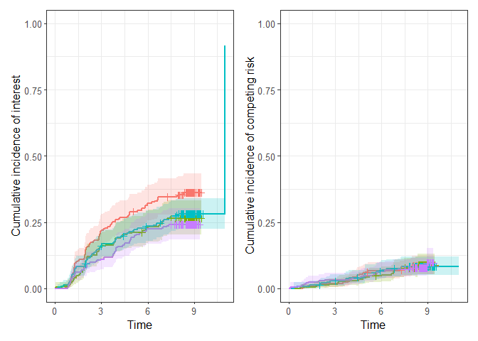
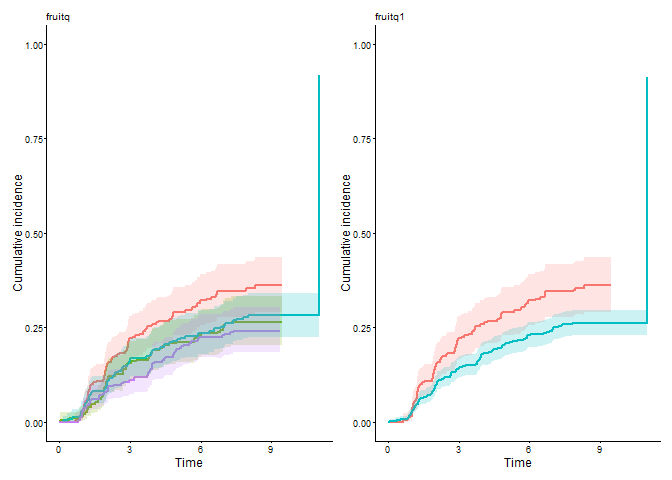
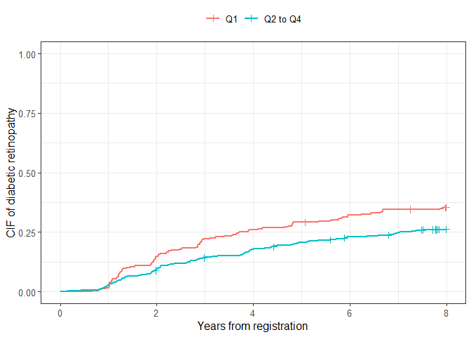
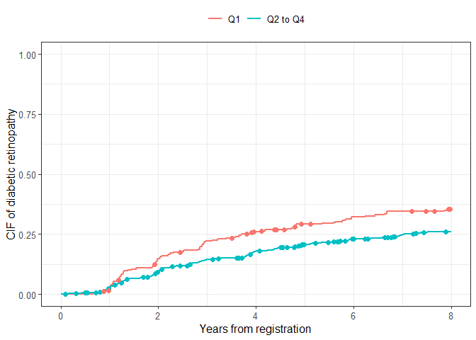

<!-- README.md is generated from README.Rmd. Please edit that file -->

<!-- badges: start -->

<!-- badges: end -->

# Visualization and Modeling of Competing Risks in R — cifmodeling

## Quick start

This package is a compact and unified toolkit for the
Kaplan–Meier/Aalen–Johansen curves, visualization, and direct polytomous
regression for survival and competing risks data.

``` r
library(cifmodeling)
data(diabetes.complications)
cifplot(Event(t,epsilon)~fruitq, data=diabetes.complications, 
        outcome.type="competing-risk", panel.per.event=TRUE)
```

<div class="figure">


<p class="caption">

Aalen–Johansen cumulative incidence curves from cifplot()
</p>

</div>

This is an example code snippet applying `cifplot()` to visualize the
Aalen–Johansen cumulative incidence functions (CIFs). In competing risks
data, censoring is often coded as 0, events of interest as 1, and
competing risks as 2. The variable `epsilon` in `diabetes.complications`
data frame represents the occurrence of competing risks according to
this coding scheme. By setting `panel.per.event=TRUE`, the CIF curve for
diabetic retinopathy (`epsilon=1`) is output on the left and
macrovascular complications (`epsilon=2`) on the right.

## Tools for survival and competing risks analysis

In clinical and epidemiological research, analysts often need to handle
censoring, competing risks, and intercurrent events (e.g., treatment
switching), but existing R packages typically separate these tasks into
different interfaces. `cifmodeling` provides a **unified,
publication-ready toolkit** that integrates description of survival and
CIF curves, regression modeling, and visualization for survival and
competing risks data. It covers both nonparametric estimation and
regression modeling of CIFs, centered around three tightly connected
functions.

- `cifplot()` typically generates a survival or CIF curve with marks
  that represent censoring, competing risks and intercurrent events.
  Multiple standard error (SE) estimators and confidence interval (CI)
  methods are supported. Visualization relies on `ggsurvfit/ggplot2`.

- `cifpanel()` generates a multi-panel figure for survival/CIF curves,
  arranged either in a grid layout or as an inset overlay.

- `polyreg()` fits coherent regression models of CIFs based on
  polytomous log odds products and the stratified inverse probability of
  censoring weighting (IPCW) estimator. This function is particularly
  well-suited for causal inference in terms of typical effect measures,
  namely risk ratios, odds ratios, and subdistribution hazard ratios,
  with a competing risks, survival, or binary outcome.

These functions adopt a formula + data syntax, return tidy,
publication-ready outputs, and integrate seamlessly with `ggsurvfit` and
`modelsummary` for visualization.

## Installation

The package is implemented in R and relies on `Rcpp`, `nleqslv` and
`boot` for the numerical back-end. The examples in this document also
use `ggplot2`, `ggsurvfit`, `patchwork` and `modelsummary` for
tabulation and plotting. Install the core package and these companion
packages with:

``` r
install.packages("Rcpp")
install.packages("nleqslv")
install.packages("boot")
install.packages("ggplot2")
install.packages("ggsurvfit")
install.packages("patchwork")
install.packages("modelsummary")
devtools::install_github("gestimation/cifmodeling")
```

## Quality control

`cifmodeling` includes an extensive test suite built with **testthat**,
ensuring the numerical accuracy and graphical consistency of all core
functions (`cifcurve`, `cifplot`, `cifpanel`, and `polyreg`). The
package is continuously tested on GitHub Actions (Windows, macOS, Linux)
to maintain reproducibility and CRAN-level compliance.

## Example. Competing risks analysis

For the initial illustration, unadjusted analysis focusing on cumulative
incidence of diabetic retinopathy (event 1) and macrovascular
complications (event 2) at 8 years of follow-up is demonstrated. To
visualize each covariate separately when multiple strata are supplied,
set `panel.per.variable = TRUE`. Each variable on the right-hand side is
plotted in its own panel, and the layout can be controlled with
`rows.columns.panel`. The figure below contrasts the CIFs of diabetic
retinopathy for the quartiles `fruitq` and a binary exposure `fruitq1`,
low (Q1) and high (Q2 to 4) intake of fruit, generated by `cifplot()`.
The `add.conf=TRUE` argument adds CIs to the plot. This helps visualize
the statistical uncertainty of estimated probabilities across exposure
levels. When using numeric variables for stratification, discretize them
beforehand with `cut()` or `factor()`. The labels of x-axis (Time) and
y-axis (Cumulative incidence) in these panels are default labels.

``` r
data(diabetes.complications)
diabetes.complications$fruitq1 <- ifelse(
  diabetes.complications$fruitq == "Q1","Q1","Q2 to Q4"
)
cifplot(Event(t,epsilon)~fruitq+fruitq1, data=diabetes.complications, 
        outcome.type="competing-risk",
        add.conf=TRUE, add.censor.mark=FALSE, 
        add.competing.risk.mark=FALSE, panel.per.variable=TRUE)
```

<div class="figure">


<p class="caption">

Cumulative incidence curves per each stratification variable
</p>

</div>

In the second figure, censoring marks are added along each curve
(`add.censor.mark = TRUE`) to indicate individuals who were censored
before experiencing any event. These marks visualize the timing and
frequency of censoring, allowing a clearer understanding of
loss-to-censoring patterns over follow-up. Here the workflow differs
slightly from the previous code. First, we compute a survfit-compatible
object `output1` using `cifcurve()` with `outcome.type="competing-risk"`
by calculating the Aalen–Johansen estimator stratified by `fruitq1`.
Then, `cifplot()` is used to generate the figure. The `label.y`,
`label.x` and `limit.x` arguments are also used to customize the axis
labels and limits.

``` r
output1 <- cifcurve(Event(t,epsilon)~fruitq1, data=diabetes.complications, 
                    outcome.type="competing-risk")
cifplot(output1, add.conf=FALSE, add.risktable=FALSE, 
        add.censor.mark=TRUE, add.competing.risk.mark=FALSE, 
        label.y="CIF of diabetic retinopathy", label.x="Years from registration",
        limits.x=c(0,8))
```

<div class="figure">


<p class="caption">

Cumulative incidence curves with censor marks and axis labels
</p>

</div>

Next, competing risk marks are added (`add.competing.risk.mark = TRUE`)
to indicate individuals who experienced the competing event
(macrovascular complications) before diabetic retinopathy. The time
points at which the macrovascular complications occurred were obtained
as `output2` for each strata using a helper function
`extract_time_to_event()`. These symbols help distinguish between events
due to the primary cause and those attributable to competing causes.
Note that the names of `competing.risk.time` and
`intercurrent.event.time` must match the strata labels used in the plot
if supplied by the user.

``` r
output2 <- extract_time_to_event(Event(t,epsilon)~fruitq1, 
                                 data=diabetes.complications, which_event="event2")
cifplot(output1, add.conf=FALSE, add.risktable=FALSE, 
        add.censor.mark=FALSE, add.competing.risk.mark=TRUE, competing.risk.time=output2, 
        label.y="CIF of diabetic retinopathy", label.x="Years from registration",
        limits.x=c(0,8))
```

<div class="figure">


<p class="caption">

Cumulative incidence curves with competing risk marks
</p>

</div>

The `label.strata` is another argument for customizing labels, but when
inputting a survfit object, it becomes invalid because it does not
contain stratum information. Therefore, the following code inputs the
formula and data. `label.strata` is used by combining `level.strata` and
`order.strata`. `level.strata` specifies the levels of the
stratification variable corresponding to each label in `label.strata`.
The levels specified in `level.strata` are then displayed in the figure
in the order defined by `order.strata`. A figure enclosed in a square
was generated, which is due to `style="framed"` specification.

``` r
cifplot(Event(t,epsilon)~fruitq1, data=diabetes.complications, 
        outcome.type="competing-risk", add.conf=FALSE, add.risktable=FALSE, 
        add.estimate.table=TRUE, add.censor.mark=FALSE, add.competing.risk.mark=TRUE, 
        competing.risk.time=output2, label.y="CIF of diabetic retinopathy", 
        label.x="Years from registration", limits.x=c(0,8),
        label.strata=c("High intake","Low intake"), level.strata=c("Q2 to Q4","Q1"), 
        order.strata=c("Q1", "Q2 to Q4"), style="framed")
```

<div class="figure">


<p class="caption">

Cumulative incidence curves with strata labels and FRAMED style
</p>

</div>

By specifying `add.estimate.table = TRUE`, the risks of diabetic
retinopathy (estimates for CIFs) along with their CIs are shown in the
table at the bottom of the figure. The risk ratios at a specific time
point (e.g. 8 years) for competing events can be jointly and coherently
estimated using `polyreg()` with `outcome.type = "competing-risk"`. In
the code of `polyreg()` below, no covariates are included in the
nuisance model (`~1` specifies intercept only). The effect of low fruit
intake `fruitq1` is estimated as an unadjusted risk ratio
(`effect.measure1="RR"`) for diabetic retinopathy (event 1) and
macrovascular complications (event 2) at 8 years (`time.point=8`).

``` r
output3 <- polyreg(nuisance.model=Event(t,epsilon)~1, exposure="fruitq1", 
          data=diabetes.complications, effect.measure1="RR", effect.measure2="RR", 
          time.point=8, outcome.type="competing-risk", 
          report.nuisance.parameter=TRUE)
coef(output3)
#> [1] -1.38313159 -0.30043942 -3.99147406 -0.07582595
vcov(output3)
#>              [,1]         [,2]         [,3]         [,4]
#> [1,]  0.017018160 -0.012351309  0.009609321 -0.008372500
#> [2,] -0.012351309  0.012789187 -0.006012254  0.006540183
#> [3,]  0.009609321 -0.006012254  0.048161715 -0.044070501
#> [4,] -0.008372500  0.006540183 -0.044070501  0.055992232
summary(output3)
#> 
#>                       event1        event2      
#> ---------------------------------------------- 
#> Intercept            
#>                       -1.383        -3.991      
#>                       [-1.639, -1.127]  [-4.422, -3.561]
#>                       (p=0.000)     (p=0.000)   
#> 
#> fruitq1, Q2 to Q4 vs 0 
#>                       -0.300        -0.076      
#>                       [-0.522, -0.079]  [-0.540, 0.388]
#>                       (p=0.008)     (p=0.749)   
#> 
#> ---------------------------------------------- 
#> 
#> effect.measure        RR at 8       RR at 8     
#> n.events              279 in N = 978  79 in N = 978
#> median.follow.up      8             -           
#> range.follow.up       [0.05, 11.00]  -           
#> n.parameters          4             -           
#> converged.by          Converged in objective function  -           
#> nleqslv.message       Function criterion near zero  -
```

The `summary()` method prints an event-wise table of point estimates,
CIs, and p-values. Internally, this table is stored in a `summary`
component of the `"polyreg"` object, which is compatible with the
`modelsummary` ecosystem. If you want more elaborate tables, you can
optionally pass this object to `modelsummary::msummary()`. In this case,
all regression coefficients are included in the summary by setting
`report.nuisance.parameter = TRUE`. Model summaries can also be
exponentiated to display risk ratios, odds ratios, or subdistribution
hazard ratios using the `exponentiate` option.
