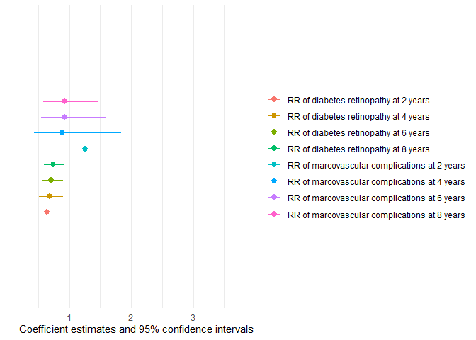

<!-- README.md is generated from README.Rmd. Please edit that file -->

<!-- badges: start -->

<!-- badges: end -->

# Visualization and Modeling of Survival and Competing Risks Data — cifmodeling

## Quick start

This package is a compact, high-level extension of the existing
`survival` ecosystem. It provides a unified interface for Kaplan-Meier
and Aalen-Johansen curves, modern visualization, and direct polytomous
regression for survival and competing risks data.

``` r
library(cifmodeling)
data(diabetes.complications)
cifplot(Event(t,epsilon)~fruitq, data=diabetes.complications, 
        outcome.type="competing-risk", panel.per.event=TRUE)
```

<div class="figure">


<p class="caption">

Aalen-Johansen cumulative incidence curves from cifplot()
</p>

</div>

In competing risks data, censoring is often coded as 0, the event of
interest as 1, and competing risks as 2. In the `diabetes.complications`
data frame, `epsilon` follows this convention. With
`panel.per.event = TRUE`, `cifplot()` visualizes the cumulative
incidence functions (CIFs), with the CIF of diabetic retinopathy
(`epsilon = 1`) shown on the left and the CIF of macrovascular
complications (`epsilon = 2`) on the right.

## Why cifmodeling?

- **Unified interface** for Kaplan–Meier and Aalen–Johansen curves, with
  survival and competing risks handled by the same `Event()` + formula +
  data syntax.
- **Effects on the CIF scale**: while Fine-Gray models subdistribution
  hazards, `polyreg()` directly targets ratios of CIFs (risk ratios,
  odds ratios, subdistribution hazard ratios), so parameters align
  closely with differences seen in CIF curves.
- **Coherent, joint modeling of all competing events**: `polyreg()`
  models all cause-specific CIFs together, parameterizing the nuisance
  structure with polytomous log odds products and enforcing that their
  CIFs sum to at most one.
- **Tidy summaries and reporting**: support for `generics::tidy()`,
  `glance()`, and `augment()`, which integrates `polyreg()` smoothly
  with `modelsummary` and other broom-style tools.
- **Publication-ready graphics** built on `ggsurvfit` and `ggplot2`,
  including at-risk/CIF+CI tables,
  censoring/competing-risk/intercurrent-event marks, and multi-panel
  layouts.

## Tools for survival and competing risks analysis

In clinical and epidemiological research, analysts often need to handle
censoring, competing risks, and intercurrent events (e.g. treatment
switching), but existing R packages typically separate these tasks
across different interfaces. `cifmodeling` provides a unified,
publication-ready toolkit that integrates nonparametric estimation,
regression modelling, and visualization for survival and competing risks
data. The package is centered around three tightly connected functions:

- `cifplot()` typically generates a survival or CIF curve with marks
  that represent censoring, competing risks and intercurrent events.
  **Multiple standard error (SE) estimators and confidence interval (CI)
  methods valid for unweighted and weighted data are supported.** The
  visualization is built on top of `ggsurvfit` and `ggplot2`.

- `cifpanel()` creates a multi-panel figure for survival/CIF curves,
  arranged either **in a grid layout or as an inset overlay**.

- `polyreg()` fits **coherent regression models** of CIFs using
  polytomous log odds products.

These functions adopt a formula + data syntax, return tidy,
publication-ready outputs, and integrate seamlessly with `ggsurvfit` and
`modelsummary` for visualization and reporting.

## Position in the survival ecosystem

Several excellent R packages exist for survival and competing risks
analysis. The **survival** package provides the canonical API for
survival data. In combination with the **ggsurvfit** package,
`survival::survfit()` can produce publication-ready survival plots. For
CIF plots, however, integration in the general ecosystem is less
streamlined. `cifmodeling` fills this gap by offering `cifplot()` for
survival/CIF plots and multi-panel figures via a single, unified
interface.

Beyond providing a unified interface, `cifcurve()` also extends
`survfit()` in a few targeted ways. For unweighted survival data, it
reproduces the standard Kaplan-Meier estimator with **Greenwood and
Tsiatis SEs** and a unified set of CI transformations. For competing
risks data, it computes Aalen-Johansen CIFs with both **Aalen-type and
delta-method SEs**. For weighted survival or competing risks data
(e.g. inverse probability weighting), it implements **influence-function
based SEs** (Deng and Wang 2025) as well as **modified Greenwood- and
Tsiatis-type SEs** (Xie and Liu 2005), which are valid under general
positive weights.

If you need very fine-grained plot customization, you can compute the
estimator and keep a survfit-compatible object with `cifcurve()` (or
supply your own survfit object) and then style it using
`ggsurvfit/ggplot2` layers. In other words:

- use `cifcurve()` for estimation,
- use `cifplot()` / `cifpanel()` for quick, high-quality figures, and
- fall back to the `ggplot` ecosystem when you want full artistic
  control.

The **mets** package is a more specialised toolkit that provides
advanced methods for competing risks analysis. `cifmodeling::polyreg()`
focuses on coherent modelling of all CIFs simultaneously to estimate the
exposure effects in terms of RR/OR/SHR. This coherence can come with
longer runtimes for large problems. If you prefer fitting separate
regression models for each competing event or specifically need the
Fine-Gray models (Fine and Gray 1999) and the direct binomial models
(Scheike, Zhang and Gerds 2008), `mets::cifreg()` and `mets::binreg()`
are excellent choices.

## Installation

The package is implemented in R and relies on `Rcpp`, `nleqslv` and
`boot` for its numerical back-end. The examples in this document also
use `ggplot2`, `ggsurvfit`, `patchwork` and `modelsummary` for
tabulation and plotting. Install the core package and these companion
packages with:

``` r
# Install cifmodeling from GitHub
devtools::install_github("gestimation/cifmodeling")

# Core dependencies
install.packages(c("Rcpp", "nleqslv", "boot"))

# Recommended packages for plotting and tabulation in this README
install.packages(c("ggplot2", "ggsurvfit", "patchwork", "modelsummary"))
```

## Quality control

`cifmodeling` includes an extensive test suite built with **testthat**,
which checks the numerical accuracy and graphical consistency of all
core functions (`cifcurve()`, `cifplot()`, `cifpanel()`, and
`polyreg()`). The estimators are routinely compared against related
functions in **survival**, **cmprsk** and **mets** packages to ensure
consistency. The package is continuously tested on GitHub Actions
(Windows, macOS, Linux) to maintain reproducibility and CRAN-level
compliance.

## A workflow of competing risks analysis

This section sketches a typical competing risks workflow with four code
snippets.

- Describe the competing risks via a CIF plot with marks
- Plot IPTW-adjusted CIFs using weights from a propensity score model
- Estimate risk ratios for all competing events at a clinically relevant
  time
- Visualize how risk ratios evolve over time

We use the `diabetes.complications` data throughout, focusing on
diabetic retinopathy (event 1) and macrovascular complications (event
2), with the level of fruit intake, low (Q1) and high (Q2 to 4), as the
exposure (`fruitq1`).

### CIF plot with competing-risk marks

The first snippet is plotting the CIF of diabetic retinopathy with
**marks indicating individuals who experienced macrovascular
complications first** (`add.competing.risk.mark = TRUE`). Here we show a
workflow slightly different from the code at the beginning. First, the
time points at which the macrovascular complications occurred were
obtained as `output1` for each strata using a helper function
`extract_time_to_event()`. Then, `cifplot()` is used to generate the
figure. The `label.y`, `label.x`, `label.strata` and `limit.x` arguments
are also used to customize **the labels and axis limits**.

``` r
data(diabetes.complications)
output1 <- extract_time_to_event(Event(t,epsilon)~fruitq1, 
                                 data=diabetes.complications, which.event="event2")
cifplot(Event(t,epsilon)~fruitq1, data=diabetes.complications, 
        outcome.type="competing-risk",
        add.conf=FALSE, add.risktable=FALSE, add.censor.mark=FALSE,
        add.competing.risk.mark=TRUE, competing.risk.time=output1,
        label.y="CIF of diabetic retinopathy", label.x="Years from registration",
        limits.x=c(0,8), label.strata=c("High intake","Low intake"), 
        level.strata=c(0, 1), order.strata=c(0, 1))
```

<div class="figure">


<p class="caption">

Cumulative incidence curves with competing risk marks
</p>

</div>

### IPTW-adjusted CIF with CBPS()

In an observational study, it is necessary to adjust for confounders in
order to compare fruit intake levels. In the next example, we obtain
inverse-probability weights from `CBPS()` and draw IPTW-adjusted CIFs.
It is important to note that in IPTW analysis, the SEs output in the
unweighted analysis are not necessarily valid. Among the SE methods
selectable in `cifplot()`, Aalen-type, delta-type, and
influence-function-type, simulations by Deng and Wang (2025)
demonstrated that the SE based on influence function works well. This
snippet displays valid CIs in the plot by specifying `error=“if”` and
`add.conf=TRUE`.

``` r
if (requireNamespace("CBPS", quietly = TRUE)) {
 library(CBPS)

 output2 <- CBPS(
  fruitq1 ~ age + sex + bmi + hba1c + diabetes_duration + drug_oha + drug_insulin
   + sbp + ldl + hdl + tg + current_smoker + alcohol_drinker + ltpa,
  data = diabetes.complications, ATT=0
 )

 diabetes.complications$ipw <- output2$weights

 cifplot(Event(t,epsilon)~fruitq1, data=diabetes.complications, 
         outcome.type="competing-risk", weights = "ipw", 
         add.conf=TRUE, add.risktable=FALSE, add.censor.mark=FALSE,
         label.y="CIF of diabetic retinopathy", label.x="Years from registration",
         limits.x=c(0,8), label.strata=c("High intake","Low intake"), 
         level.strata=c(0, 1), order.strata=c(0, 1), error = "if")
} else {
 plot.new()
 text(0.5, 0.5,
 "Install the 'CBPS' package to run the this example.",
 cex = 0.9)
}
```

<div class="figure">


<p class="caption">

IPTW-adjusted cumulative incidence curves with CIs based on influence
functions
</p>

</div>

### Risk ratios for all competing events via polyreg()

We then fit `polyreg()` to estimate risk ratios for diabetes retinopathy
and macrovascular complications, in a coherent joint model of all
cause-specific CIFs at 8 years.

``` r
output3 <- polyreg(nuisance.model=Event(t,epsilon)~1, exposure="fruitq1", 
          data=diabetes.complications, effect.measure1="RR", effect.measure2="RR", 
          time.point=8, outcome.type="competing-risk")
summary(output3)
#> 
#>                       event1        event2      
#> ---------------------------------------------- 
#> fruitq1, 1 vs 0      
#>                       1.350         1.079       
#>                       [1.114, 1.637]  [0.682, 1.707]
#>                       (p=0.002)     (p=0.746)   
#> 
#> ---------------------------------------------- 
#> 
#> effect.measure        RR at 8       RR at 8     
#> n.events              279 in N = 978  79 in N = 978
#> median.follow.up      8             -           
#> range.follow.up       [0.05, 11.00]  -           
#> n.parameters          4             -           
#> converged.by          Converged in objective function  -           
#> nleqslv.message       Function criterion near zero  -
```

The `summary()` method prints an event-wise table of point estimates,
CIs, and p-values. Internally, a `"polyreg"` object also supports the
**generics** API:

- `tidy()`: coefficient-level summaries (one row per term and per
  event),
- `glance()`: model-level summaries (follow-up, convergence, number of
  events),
- `augment()`: observation-level diagnostics (weights for IPCW,
  predicted CIFs, and influence functions).

### Risk ratios over time with `modelplot()`

Finally, we repeat the model at multiple time points and use
`modelplot()` to visualize how risk ratios evolve over follow-up. With
generics-Compatible objects, `polyreg()` is integrated naturally with
the broader `broom/modelsummary` ecosystem. For publication-ready
tables, you can pass `polyreg` objects directly to
`modelsummary::msummary()` and `modelsummary::modelplot()`, including
exponentiated summaries (risk ratios, odds ratios, subdistribution
hazard ratios) via the `exponentiate = TRUE` option.

``` r

if (requireNamespace("modelsummary", quietly = TRUE)) {
 library(modelsummary)
 output4 <- polyreg(nuisance.model=Event(t,epsilon)~1, exposure="fruitq1", 
                    data=diabetes.complications, effect.measure1="RR", effect.measure2="RR", 
                    time.point=2, outcome.type="competing-risk")
 output5 <- polyreg(nuisance.model=Event(t,epsilon)~1, exposure="fruitq1", 
                    data=diabetes.complications, effect.measure1="RR", effect.measure2="RR", 
                    time.point=4, outcome.type="competing-risk")
 output6 <- polyreg(nuisance.model=Event(t,epsilon)~1, exposure="fruitq1", 
                    data=diabetes.complications, effect.measure1="RR", effect.measure2="RR", 
                    time.point=6, outcome.type="competing-risk")
 summary <- list(
  "RR of diabetes retinopathy at 2 years" = output4$summary$event1, 
  "RR of diabetes retinopathy at 4 years" = output5$summary$event1, 
  "RR of diabetes retinopathy at 6 years" = output6$summary$event1, 
  "RR of diabetes retinopathy at 8 years" = output3$summary$event1,
  "RR of marcovascular complications at 2 years" = output4$summary$event2, 
  "RR of marcovascular complications at 4 years" = output5$summary$event2, 
  "RR of marcovascular complications at 6 years" = output6$summary$event2, 
  "RR of marcovascular complications at 8 years" = output3$summary$event2
 )
 modelplot(summary, coef_rename="", exponentiate = TRUE)
} else {
 plot.new()
 text(0.5, 0.5,
 "Install the 'modelsummary' package to run this example.",
 cex = 0.9)
}
```

<div class="figure">


<p class="caption">

Visualizaton of risk ratios at 2, 4, 6 and 8 years using polyreg() and
modelplot()
</p>

</div>
