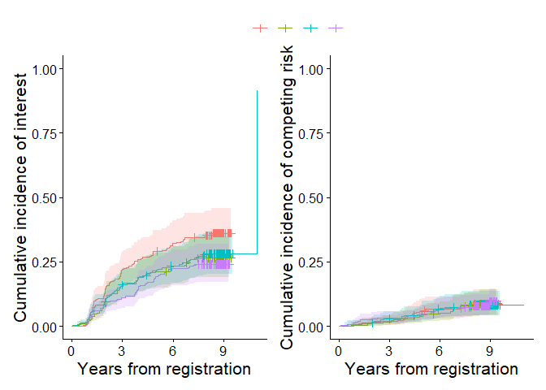
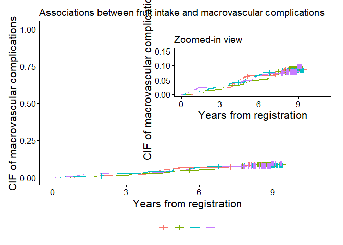
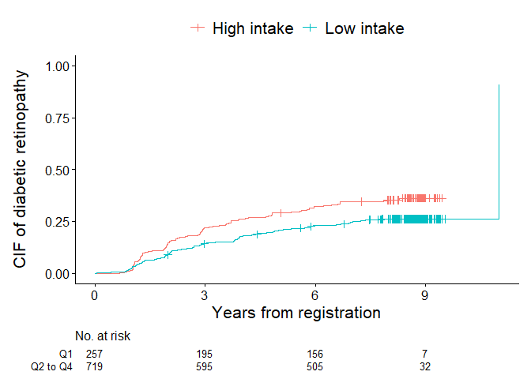
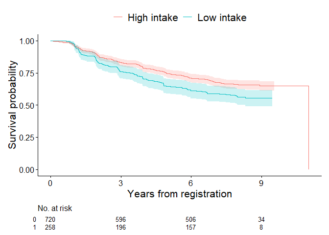

<!-- README.md is generated from README.Rmd. Please edit that file -->

# Visualization and Modeling of Competing Risks in R — cifmodeling

<!-- badges: start -->

<!-- badges: end -->

## Overview

In medical and epidemiological research, analysts often need to handle
censoring, competing risks, and intercurrent events (e.g., treatment
switching), but existing R packages typically separate these tasks into
different interfaces. `cifmodeling` provides a **unified,
publication-ready toolkit** that integrates description of survival and
cumulative incidence function (CIF) curves, regression modeling, and
visualization for survival and competing risks data. It covers both
nonparametric estimation and regression modeling of CIFs, centered
around three tightly connected functions.

- `cifplot()` typically generates a survival or cumulative incidence
  curve with marks that represent censoring, competing risks and
  intercurrent events. Multiple variance estimators and confidence
  interval methods are supported. Visualization relies on
  `ggsurvfit/ggplot2`.

- `cifpanel()` generates a multi-panel figure for survival/CIF curves,
  arranged either in a grid layout or as an inset overlay.

- `polyreg()` fits coherent regression models of CIFs based on
  polytomous log odds products and the stratified IPCW estimator. This
  function is particularly well-suited for causal inference in terms of
  typical effect measures, namely risk ratios, odds ratios, and
  subdistribution hazard ratios, with a competing risks, survival, or
  binary outcome.

These functions adopt a formula + data syntax, return tidy,
publication-ready outputs, and integrate seamlessly with `ggsurvfit` and
`modelsummary` for visualization.

## Quality control

`cifmodeling` includes an extensive test suite built with **testthat**,
ensuring the numerical accuracy and graphical consistency of all core
functions (`cifcurve`, `cifplot`, `cifpanel`, and `polyreg`). The
package is continuously tested on GitHub Actions (Windows, macOS, Linux)
to maintain reproducibility and CRAN-level compliance.

## Installation

The package is implemented in R and relies on `Rcpp`, `nleqslv` and
`boot` for the numerical back-end. The examples in this README also use
`ggplot2`, `ggsurvfit`, `patchwork` and `modelsummary` for tabulation
and plotting. Install the core package and these companion packages
with:

``` r
install.packages("Rcpp")
install.packages("nleqslv")
install.packages("boot")
install.packages("ggplot2")
install.packages("ggsurvfit")
install.packages("patchwork")
install.packages("modelsummary")
devtools::install_github("gestimation/cifmodeling")
```

## Main functions

### cifplot()

This function produces the **Kaplan–Meier survival** or **Aalen–Johansen
cumulative incidence** curve from a unified formula + data interface
(`Event()` or `Surv()` on the left-hand side). It auto-labels axes based
on `outcome.type` and `type.y`, can add
censoring/competing-risk/intercurrent-event marks, and returns a regular
ggplot object (compatible with + and %+%). You may also pass a
survfit-compatible object directly.

**Typical use cases**

- Draw one survival/CIF curve set by exposure groups (e.g., treatment vs
  control).
- Call `cifpanel()` with a simplified code to create a panel displaying
  plots of multiple stratified survival/CIF curves or CIF curves for
  each event type.
- Add confidence intervals and censor/competing-risk/intercurrent-event
  marks.
- Add a risk table to display the number at risk or the estimated
  survival probabilities or CIFs and 95% confidence intervals at each
  point in time.

**Key arguments shared with cifcurve()**

- **Outcome type and estimator**
  - `outcome.type = "SURVIVAL"` → Kaplan–Meier estimator
  - `outcome.type = "COMPETING-RISK"` → Aalen–Johansen estimator
- **Confidence intervals**
  - `conf.int` sets the two-sided level (default 0.95)  
  - `conf.type` chooses the transformation (`"arcsin"`, `"plain"`,
    `"log"`, `"log-log"`, `"logit"`, or `"none"`)
  - `error` chooses the estimator for standard error (`"greenwood"` or
    `"tsiatis"` for survival curves and `"delta"` or `"aalen"` for CIFs)

**Key arguments for cifplot()**

- **Data visualization**
  - `addConfidenceInterval` adds confidence intervals on the
    ggplot2-based plot
  - `addCompetingRiskMark` and `addIntercurrentEventMark` add symbols to
    describe competing risks or intercurrent events in addition to
    conventional censoring marks with `addCensorMark`
  - `addRiskTable` adds numbers at risk
  - `addEstimateTable` adds estimates and 95% confidence interval
  - `addQuantileLine` adds a line that represents median or quantile
- **Plot customization**
  - `type.y` chooses y-axis. (`"surv"` for survival curves and `"risk"`
    for CIFs)
  - `limits.x`, `limits.y`, `breaks.x`, `breaks.y` numeric vectors for
    axis control
  - `style` specifies the appearance of plot (`"CLASSIC"`, `"BOLD"`,
    `"FRAMED"`, `"GRID"`, `"GRAY"` or `"GGSURVFIT"`)
- **Panel display**
  - `printEachVar` produces multiple survival/CIF curves per
    stratification variable specified in the formula
  - `printEachEvent` produces CIF curves for each event type
  - `printCensoring` produces KM-type curves for (event, censor) and
    (censor, event) so that censoring patterns can be inspected
  - `printPanel` automatic panel mode

**Return**

- A **ggplot** object.

**Under the hood: cifcurve()**

`cifplot()` is a streamlined, opinionated wrapper around `cifcurve()`,
which calculates the Kaplan–Meier estimator and the Aalen–Johansen
estimator. `cifcurve()` returns a survfit-compatible object, enabling an
independent use of standard methods such as:

- `summary()` — time-by-time estimates with standard errors and
  confidence intervals
- `plot()` — base R stepwise survival/CIF curves
- `mean()` — restricted mean survival estimates with confidence
  intervals
- `quantile()` — quantile estimates with confidence intervals

Furthermore, the cifmodeling package provides a workflow for a
**ggplot2-based visualization** based on the survfit-compatible objects
by passing them to `cifplot()` and `cifpanel`.

**An example of usage**

In competing risks data, censoring is often coded as 0, events of
interest as 1, and competing risks as 2. The variable `epsilon` in
`diabetes.complications` dataframe represents the occurrence of
competing risks according to this coding scheme. Below is an example
code snippet applying `cifplot()` to create CIF curves. By specifying
`printEachEvent=`, the CIF curve for diabetic retinopathy (`epsilon=1`)
is output on the left, and the CIF curve for macrovascular complications
(`epsilon=2`) is output on the right.

``` r
data(diabetes.complications)
cifplot(Event(t,epsilon) ~ fruitq, data=diabetes.complications, 
        outcome.type="COMPETING-RISK", printEachEvent=TRUE,
        label.x      = "Years from registration")
```



### cifpanel()

`cifpanel()` arranges multiple `cifplot()/cifcurve()` results into a
unified grid layout with consistent scales, shared legend, and
synchronized themes. It is ideal for visual comparison across outcomes,
time scales, or strata. The inset feature also allows you to display
another plot within a plot.

**Typical use cases** - Compare CIF (event 1) vs CIF (event 2) in a 1×2
layout.

- Compare survival/CIF curves across strata with a shared legend and
  matched axes.

- Display a plot with an enlarged y-axis within a plot scaled from 0 to
  100%.

**Key arguments**

- `formula` or `formulas` — one formula or a list of formulas; each
  entry creates a panel.
- `data`, `outcome.type`, `code.events`, `type.y` — recycled across
  panels unless a list is supplied for per-panel control.
- `rows.columns.panel` — selects grid layout by c(rows, cols).
- `use_inset_element` — selects inset layout.
- `title.panel`, `subtitle.panel`, `caption.panel`, `title.plot` —
  overall titles and captions.
- `tag_levels.panel` — panel tag style (e.g., “A”, “a”, “1”).
- `label.x`, `label.y`, `limits.x`, `limits.y`, `breaks.x`, `breaks.y` —
  shared axis control unless a list is supplied for per-panel control.

**Return**

- A **patchwork** object (still ggplot-compatible).

**An example of usage**

In the first example, `cifplot()` called `cifpanel()` to combine
multiple plots. `cifpanel()` is a function for creating a panel with
multiple plots like this. `cifpanel()` can also display one plot inside
another. The cumulative incidence probability for macrovascular
complications is low, making it difficult to discern differences between
groups. The following code uses `use_inset_element=` to display plot
`output2`, with an enlarged vertical axis, inside plot `output1`.

``` r
output1 <- cifplot(Event(t,epsilon) ~ fruitq,
                   data = diabetes.complications,
                   outcome.type="COMPETING-RISK",
                   code.event1=2,
                   code.event2=1,
                   addConfidenceInterval = FALSE,
                   addRiskTable = FALSE,
                   label.y='CIF of macrovascular complications',
                   label.x='Years from registration')
output2 <- cifplot(Event(t,epsilon) ~ fruitq,
                   data = diabetes.complications,
                   outcome.type="COMPETING-RISK",
                   code.event1=2,
                   code.event2=1,
                   addConfidenceInterval = FALSE,
                   addRiskTable = FALSE,
                   label.y='CIF of macrovascular complications',
                   label.x='Years from registration',
                   limits.y=c(0,0.15))
output3 <- list(a=output1, b=output2)
cifpanel(plots = output3,
         title.plot = c("Associations between fruit intake and macrovascular complications", "Zoomed-in view"),
         use_inset_element = TRUE,
         inset.left   = 0.40, inset.bottom = 0.45,
         inset.right  = 1.00, inset.top    = 0.95,
         inset.align_to = "plot",
         inset.legend.position = "none",
         legend.position = "bottom")
```



The code below, in which a formula and data is given directly, produces
the same output as above.

``` r
data(diabetes.complications)
cifpanel(
 title.plot = c("Associations between fruit intake and macrovascular complications", "Zoomed-in view"),
 use_inset_element = TRUE,
 formula = Event(t, epsilon) ~ fruitq,
 data = diabetes.complications,
 outcome.type = "COMPETING-RISK",
 code.events = list(c(2,1,0), c(2,1,0)),
 label.y = c("CIF of macrovascular complications", ""),
 label.x = c("Years from registration", ""),
 limits.y     = list(c(0,1), c(0,0.15)),
 inset.left   = 0.40, inset.bottom = 0.45,
 inset.right  = 1.00, inset.top    = 0.95,
 inset.align_to = "plot",
 inset.legend.position = "none",
 legend.position = "bottom", 
 addConfidenceInterval = FALSE
)
```

### polyreg()

`polyreg()` implements **log odds product modeling** for CIFs at
user-specified time points, focusing on multiplicative effects of a
categorical exposure, or constant effects over time like Cox regression
and Fine-Gray models. It estimates multiplicative effects such as **risk
ratios**, **odds ratios**, or **subdistribution hazard ratios**, while
ensuring that the probabilities across competing events sum to one. This
is achieved through **reparameterization using polytomous log odds
products**, which fits so-called effect-measure models and nuisance
models on multiple competing events simultaneously. Additionally,
`polyreg()` supports direct binomial regression for survival outcomes
and the Richardson model for binomial outcomes, both of which use log
odds products.

The function follows the familiar **formula + data** syntax with
`Event()` or `Surv()` and outputs tidy results, including point
estimates, standard errors, confidence intervals, and p-values. Its
results can be easily summarized with `summary()` or combined with tools
such as **modelsummary** or **broom** for reporting.

**Key arguments**

- `nuisance.model` — a formula describing the outcome and nuisance
  covariates, excluding the exposure of interest.
- `exposure` — specifies the exposure variable. This argument accepts
  one binary or categorical variable.

the categorical exposure variable - `effect.measure1` and
`effect.measure2` — specifies the effect measures for event1 and event2
(`"RR"`, `"OR"` or `"SHR"`). - `outcome.type` selects the outcome type
(`"COMPETING-RISK"`, `"SURVIVAL"`, `"BINOMIAL"`,
`"PROPORTIONAL-SURVIVAL"` or `"PROPORTIONAL-COMPETING-RISK"`). -
`time.point` — specifies time points at which the exposure effect is
evaluated. Required for `"COMPETING-RISK"` and `"SURVIVAL"` outcomes. -
`strata` — specifies the stratification variable used to adjust for
dependent censoring.

**Return**

- `coefficient` — regression coefficients

- `cov` — variance-covariance matrix for regression coefficients

- `diagnostic.statistics` — a data frame containing inverse probability
  weights, influence functions, and predicted potential outcomes

- `summary` — a summary of estimated exposure effects

### An example of usage

``` r
data(diabetes.complications)
output <- polyreg(nuisance.model=Event(t,epsilon) ~ +1, exposure="fruitq", 
          data=diabetes.complications, effect.measure1="RR", 
          effect.measure2="RR", time.point=8, outcome.type="COMPETING-RISK")
```

If you only need the core functionality of `cifcurve()` and `polyreg()`,
installing `Rcpp` and `nleqslv` are enough; the other packages are
optional but recommended to reproduce the examples below.

## Direct polytomous modeling of CIFs

The model for `polyreg()` is specified by three main components:

- Nuisance model: Describes the relationship between outcomes and
  covariates (excluding exposure).

- Effect measures and time points: Defines the exposure effect to be
  estimated and the time point of interest.

- Censoring adjustment: Specifies strata for inverse probability
  weighting to adjust for dependent censoring.

**1. Nuisance Model**

The `nuisance.model` argument specifies the formula linking the outcome
to covariates. Its format depends on the outcome type:

- Competing risks or survival outcome: Use `Surv()` or `Event()` with
  time and status variables.

- Binomial outcome: Use standard R formula notation.

Default event codes:

- Competing risks outcome: 1 and 2 for event types, 0 for censoring.

- Survival outcome: 1 for events, 0 for censoring.

- Binomial outcome: 0 and 1.

Event codes can be customized using `code.event1`, `code.event2`, and
`code.censoring`. The `outcome.type` argument must be set to:

- Effects on cumulative incidence probabilities at a specific time:
  `"COMPETING-RISK"`

- Effects on a risk at a specific time: `"SURVIVAL"`

- Common effects on cumulative incidence probabilities over time:
  `"PROPORTIONAL-COMPETING-RISK"`

- Common effects on a risk over time: `"PROPORTIONAL-SURVIVAL"`

- Effects on a risk of a binomial outcome: `"BINOMIAL"`

Covariates included in `nuisance.model` should adjust for confounding
factors to obtain unbiased exposure effect estimates.

**2. Effect measures and time points**

Three effect measures available:

- Risk Ratio (RR)

- Odds Ratio (OR)

- Subdistribution Hazard Ratio (SHR)

Set the desired measure using `effect.measure1` and, for competing risks
analysis, `effect.measure2`. The `time.point` argument specifies the
follow-up time at which effects are estimated.

**3. Censoring adjustment**

Inverse probability weights adjust for dependent censoring. Use
`strata=` to specify stratification variables. If no strata are
specified, Kaplan-Meier weights are used.

**Return**

This function returns a list object that includes:

- `coefficient` — regression coefficients

- `cov` — variance-covariance matrix for regression coefficients

- `diagnostic.statistics` — a data frame containing inverse probability
  weights, influence functions, and predicted potential outcomes

- `summary` — a summary of estimated exposure effects

Use `summary` output with `msummary()` to display formatted results. The
regression coefficients and their variance-covariance matrix are
provided as `coefficient` and `cov`, respectively, with the first
element corresponding to the intercept term, subsequent elements to the
covariates in `nuisance.model`, and the last element to the variable
specified by `exposure=`. Finally, `diagnostic.statistics` is a data
frame containing inverse probability weights, influence functions, and
predicted values of the potential outcomes of individual observations.

## Example 1. Unadjusted competing risks analysis

For the initial illustration, unadjusted analysis focusing on cumulative
incidence of diabetic retinopathy (event 1) and macrovascular
complications (event 2) at 8 years of follow-up is demonstrated. To
visualize each covariate separately when multiple strata are supplied,
set `printEachVar = TRUE`. Each variable on the right-hand side is
plotted in its own panel, and the layout can be controlled with
`rows.columns.panel`. The figure below contrasts the cumulative
incidence curves of diabetic retinopathy for quartile `fruitq1` and a
binary exposure `fruitq1`, low (Q1) and high (Q2 to 4) intake of fruit,
generated by `cifplot()`. The `label.x` and `label.y` arguments
customize the axis labels. The `addConfidenceInterval=TRUE` argument
adds confidence intervals to the plot. This helps visualize the
statistical uncertainty of estimated probabilities across exposure
levels. When using numeric variables for stratification, discretize them
beforehand with `cut()` or `factor()`.

``` r
data(diabetes.complications)
diabetes.complications$fruitq1 <- ifelse(
  diabetes.complications$fruitq == "Q1",
  "Q1",
  "Q2 to Q4"
)
cifplot(Event(t,epsilon) ~ fruitq+fruitq1, data=diabetes.complications, outcome.type="COMPETING-RISK",
        addConfidenceInterval=TRUE, addCensorMark=FALSE, addCompetingRiskMark=FALSE,printEachVar = TRUE,
        label.y="CIF of diabetic retinopathy", label.x="Years from registration")
```


In the next figure, censoring marks are added along each curve
(`addCensorMark = TRUE`) to indicate individuals who were censored
before experiencing any event. These marks visualize the timing and
frequency of censoring, allowing a clearer understanding of
loss-to-censoring patterns over follow-up. Here usage of functions are
different from the code above. The survfit object `output1` initially is
generated using `cifcurve()` with `outcome.type="COMPETING-RISK"` by
calculating Aalen–Johansen estimator stratified by fruitq1. Then,
`cifplot()` is used to generate the figure.

``` r
output1 <- cifcurve(Event(t,epsilon) ~ fruitq1, data=diabetes.complications, outcome.type="COMPETING-RISK")
cifplot(output1, addConfidenceInterval=FALSE, addCensorMark=TRUE, addCompetingRiskMark=FALSE,
        outcome.type="COMPETING-RISK", label.y="CIF of diabetic retinopathy", 
        label.x="Years from registration", label.strata=c("High intake","Low intake"))
```



In the final figure, competing risk marks are added
(`addCompetingRiskMark = TRUE`) to indicate individuals who experienced
the competing event (macrovascular complications) before diabetic
retinopathy. The time points at which the macrovascular complications
occurred were obtained as `output2` for each strata using a helper
function `extract_time_to_event()`. These symbols help distinguish
between events due to the primary cause and those attributable to
competing causes.

``` r
output2 <- extract_time_to_event(Event(t,epsilon) ~ fruitq1, data=diabetes.complications, which_event="event2")
cifplot(output1, addConfidenceInterval=FALSE, addCensorMark=FALSE, addCompetingRiskMark=TRUE, 
        outcome.type="COMPETING-RISK", competing.risk.time=output2, label.y="CIF of diabetic retinopathy",  
        label.x="Years from registration", label.strata=c("High intake","Low intake"))
```


An estimate of the unadjusted risk ratio for the risk of diabetic
retinopathy at 8 years is obtained using `polyreg()` with
`outcome.type="COMPETING-RISK"`. Here, no covariates are included in the
nuisance model (intercept only). The effect of low fruit intake
`fruitq1` is estimated as a risk ratio (`effect.measure1="RR"`) for
diabetic retinopathy (event 1) and macrovascular complications (event 2)
at 8 years (`time.point=8`).

``` r
output3 <- polyreg(nuisance.model=Event(t,epsilon) ~ +1, exposure="fruitq1", 
          data=diabetes.complications, effect.measure1="RR", effect.measure2="RR", 
          time.point=8, outcome.type="COMPETING-RISK", 
          report.nuisance.parameter=TRUE)
print(output3$coefficient)
#> [1] -1.38313159 -0.30043942 -3.99147405 -0.07582595
print(output3$cov)
#>              [,1]         [,2]         [,3]         [,4]
#> [1,]  0.017018160 -0.012351309  0.009609321 -0.008372500
#> [2,] -0.012351309  0.012789187 -0.006012254  0.006540183
#> [3,]  0.009609321 -0.006012254  0.048161715 -0.044070501
#> [4,] -0.008372500  0.006540183 -0.044070501  0.055992232
```

The summaries of analysis results in the list of outputs
(e.g. `output3$summary` below) are compatible with the `modelsummary`
ecosystem, which makes it easy to create publication-ready tables in a
variety of formats. A typical workflow is to pass the `summary` element
of a `polyreg()` fit (or a list of such fits) to
`modelsummary::msummary()`. In this case, all regression coefficients
are included in summary by setting `report.nuisance.parameter = TRUE`.
Model summaries can also be exponentiated to display risk ratios, odds
ratios, or subdistribution hazard ratios using `exponentiate` option.
The summaries can be displayed in the Viewer with customized statistics
such as p-values or confidence intervals.

``` r
msummary(output3$summary, statistic = c("conf.int", "p.value"), exponentiate = TRUE)
```

<table style="width:99%;">
<colgroup>
<col style="width: 32%" />
<col style="width: 44%" />
<col style="width: 22%" />
</colgroup>
<thead>
<tr>
<th></th>
<th>event1</th>
<th>event2</th>
</tr>
</thead>
<tbody>
<tr>
<td>Intercept</td>
<td>0.251</td>
<td>0.018</td>
</tr>
<tr>
<td></td>
<td>[0.194, 0.324]</td>
<td>[0.012, 0.028]</td>
</tr>
<tr>
<td></td>
<td>(&lt;0.001)</td>
<td>(&lt;0.001)</td>
</tr>
<tr>
<td>fruitq1, Q2 to Q4 vs 0</td>
<td>0.740</td>
<td>0.927</td>
</tr>
<tr>
<td></td>
<td>[0.593, 0.924]</td>
<td>[0.583, 1.474]</td>
</tr>
<tr>
<td></td>
<td>(0.008)</td>
<td>(0.749)</td>
</tr>
<tr>
<td>effect.measure</td>
<td>RR at 8</td>
<td>RR at 8</td>
</tr>
<tr>
<td>n.events</td>
<td>279 in N = 978</td>
<td>79 in N = 978</td>
</tr>
<tr>
<td>median.follow.up</td>
<td>8</td>
<td><ul>
<li></li>
</ul></td>
</tr>
<tr>
<td>range.follow.up</td>
<td>[ 0.05 , 11 ]</td>
<td><ul>
<li></li>
</ul></td>
</tr>
<tr>
<td>n.parameters</td>
<td>4</td>
<td><ul>
<li></li>
</ul></td>
</tr>
<tr>
<td>converged.by</td>
<td>Converged in objective function</td>
<td><ul>
<li></li>
</ul></td>
</tr>
<tr>
<td>nleqslv.message</td>
<td>Function criterion near zero</td>
<td><ul>
<li></li>
</ul></td>
</tr>
</tbody>
</table>

## Example 2. Survival analysis

The second example is time to first event analysis
(`outcome.type="SURVIVAL"`) to estimate the effect on the risk of
diabetic retinopathy or macrovascular complications at 8 years. In the
code below, `cifplot()` is directly used to generate a survfit object
internally and plot it.

``` r
data(diabetes.complications)
diabetes.complications$d <- (diabetes.complications$epsilon>0)
cifplot(Event(t,d) ~ fruitq1, data=diabetes.complications, 
outcome.type="SURVIVAL", addConfidenceInterval=TRUE, addCensorMark=FALSE, 
addCompetingRiskMark=FALSE, label.y="Survival probability", 
label.x="Years from registration", label.strata=c("High intake","Low intake"))
```



The code below specifies the Richardson model on the risk of diabetic
retinopathy or macrovascular complications at 8 years
(outcome.type=“SURVIVAL”). Dependent censoring is adjusted by stratified
IPCW method (`strata='strata'`). Estimates other than the effects of
exposure (e.g. intercept) are suppressed when
`report.nuisance.parameter` is not specified.

``` r
output4 <- polyreg(nuisance.model=Event(t,d) ~ +1, 
          exposure="fruitq1", strata="strata", data=diabetes.complications,
          effect.measure1="RR", time.point=8, outcome.type="SURVIVAL")
msummary(output4$summary, statistic=c("conf.int", "p.value"), exponentiate=TRUE)
```

|                        | event 1 (no competing risk)     |
|------------------------|---------------------------------|
| fruitq1, Q2 to Q4 vs 0 | 0.777                           |
|                        | \[0.654, 0.922\]                |
|                        | (0.004)                         |
| effect.measure         | RR at 8                         |
| n.events               | 358 in N = 978                  |
| median.follow.up       | 8                               |
| range.follow.up        | \[ 0.05 , 11 \]                 |
| n.parameters           | 2                               |
| converged.by           | Converged in objective function |
| nleqslv.message        | Function criterion near zero    |

## Example 3. Adjusted competing risks analysis

The code below specifies polytomous log-odds models of both of competing
events (`outcome.type="COMPETING-RISK"`). Here 15 covariates and
censoring strata are specified in `nuisance.model=` and `strata=`,
respectively.

``` r
output5 <- polyreg(nuisance.model = Event(t,epsilon) ~ age+sex+bmi+hba1c
          +diabetes_duration+drug_oha+drug_insulin+sbp+ldl+hdl+tg
          +current_smoker+alcohol_drinker+ltpa, 
          exposure="fruitq1", strata="strata", data=diabetes.complications,
          effect.measure1="RR", time.point=8, outcome.type="COMPETING-RISK")
```

Only the regression coefficient of exposure is included in summary, so
now model summary does not display parameters of the covariates other
than exposure.

``` r
msummary(output5$summary, statistic=c("conf.int", "p.value"), exponentiate=TRUE)
```

<table style="width:99%;">
<colgroup>
<col style="width: 21%" />
<col style="width: 62%" />
<col style="width: 14%" />
</colgroup>
<thead>
<tr>
<th></th>
<th>event1</th>
<th>event2</th>
</tr>
</thead>
<tbody>
<tr>
<td>fruitq1, Q2 to Q4 vs 0</td>
<td>0.645</td>
<td>1.107</td>
</tr>
<tr>
<td></td>
<td>[0.490, 0.848]</td>
<td>[0.600, 2.042]</td>
</tr>
<tr>
<td></td>
<td>(0.002)</td>
<td>(0.745)</td>
</tr>
<tr>
<td>effect.measure</td>
<td>RR at 8</td>
<td>RR at 8</td>
</tr>
<tr>
<td>n.events</td>
<td>279 in N = 978</td>
<td>79 in N = 978</td>
</tr>
<tr>
<td>median.follow.up</td>
<td>8</td>
<td><ul>
<li></li>
</ul></td>
</tr>
<tr>
<td>range.follow.up</td>
<td>[ 0.05 , 11 ]</td>
<td><ul>
<li></li>
</ul></td>
</tr>
<tr>
<td>n.parameters</td>
<td>32</td>
<td><ul>
<li></li>
</ul></td>
</tr>
<tr>
<td>converged.by</td>
<td>Converged in relative difference</td>
<td><ul>
<li></li>
</ul></td>
</tr>
<tr>
<td>nleqslv.message</td>
<td>Jacobian is singular (1/condition=0.0e+00) (see allowSingular
option)</td>
<td><ul>
<li></li>
</ul></td>
</tr>
</tbody>
</table>

## Example 4. Description of cumulative incidence of competing events

`cifpanel()` arranges multiple survival and CIF plots into a single,
polished layout with a shared legend. It’s designed for side-by-side
comparisons—e.g., event 1 vs event 2, different groupings, or different
y-scales—while keeping axis ranges and styles consistent. Internally
each panel is produced using the same engine as `cifcurve()`, and you
can supply scalar arguments (applied to all panels) or lists to control
each panel independently.

This function accepts both shared and panel-specific arguments. When a
single formula is provided, the same model structure is reused for each
panel, and arguments supplied as lists are applied individually to each
panel. Arguments such as `code.events`, `label.strata`, or
`addCensorMark` can be given as lists, where each list element
corresponds to one panel. This allows flexible configuration while
maintaining a concise and readable syntax.

The example below creates a 1×2 panel (`rows.columns.panel = c(1,2)`)
comparing the cumulative incidence of two competing events in the same
cohort, namely CIF of diabetic retinopathy in the left panel and CIF of
macrovascular complications in the right panel. Both panels are
stratified by `fruitq1`, and the legend is shared at the bottom. The
pairs of `code.events` as a list instructs `cifpanel()` to display event
1 in the first panel and event 2 in the second panel, with event code 0
representing censoring.

``` r
cifpanel(
 title.panel = "A comparison of cumulative incidence of competing events",
 rows.columns.panel = c(1,2),
 formula = Event(t, epsilon) ~ fruitq1,
 data = diabetes.complications,
 outcome.type = "COMPETING-RISK",
 code.events = list(c(1,2,0), c(2,1,0)),
 label.y = c("Diabetic retinopathy", "Macrovascular complications"),
 label.x = "Years from registration",
 label.strata = list(c("High intake","Low intake")),
 title.plot = c("Diabetic retinopathy", "Macrovascular complications"),
 legend.position = "bottom",
 legend.collect=TRUE
)
```

Arguments specified as scalars (for example,
`label.x = "Years from registration"`) are applied uniformly to all
panels. Character vectors of the same length as the number of panels
(for example,
`label.y = c("Diabetic retinopathy", "Macrovascular complications")`)
assign a different label to each panel in order. Lists provide the most
flexibility, allowing each panel to have distinct settings that mirror
the arguments of `cifcurve()`.

The `legend.collect = TRUE` option merges legends from all panels into a
single shared legend, positioned according to `legend.position`. The
arguments `title.panel`, `subtitle.panel`, `caption.panel`, and
`title.plot` control the overall panel title and individual subplot
titles, ensuring that multi-panel layouts remain consistent and
publication-ready.

## Additional information

### Comparison of model formula and outcome.type across cifcurve() and polyreg()

**Common ground**

- Both functions expect a `Surv()` or `Event()` response on the
  left-hand side of the model formula so that follow-up time and event
  indicators are supplied in the same way. Internally the helpers
  validate non-negative times, check that the event codes match the
  user-specified `code.event*` arguments, and derive indicators used
  downstream.
- The `outcome.type` argument is normalized by the same utility, meaning
  that the same set of synonyms (e.g. `"C"`, `"competing risk"`, or
  `"S"`) are accepted in both workflows and mapped onto the canonical
  labels used in the estimators.

**Key differences**

- In `cifcurve()` the right-hand side of the formula defines the
  grouping variable(s) whose curves are estimated; weights (if any) are
  supplied separately. There is no dedicated exposure argument because
  all strata are handled through the formula term that is turned into a
  factor for plotting and estimation.
- In `polyreg()` the `nuisance.model` formula describes only the outcome
  and nuisance covariates (i.e. confounders), while the exposure is
  passed separately through the `exposure` argument. The exposure design
  matrix, reference level handling, and scaling of nuisance covariates
  are handled explicitly for regression fitting.
- `cifcurve()` focuses on two estimands, selecting between Kaplan–Meier
  and Aalen–Johansen calculations via `outcome.type = "SURVIVAL"` or
  `"COMPETING-RISK"`. In contrast, `polyreg()` supports additional
  time-constant and binomial estimands (`"PROPORTIONAL-SURVIVAL"`,
  `"PROPORTIONAL-COMPETING-RISK"`, `"BINOMIAL"`) and enforces time-point
  requirements accordingly—for example `time.point` is mandatory for
  survival/competing-risk contrasts, while time-constant-effect models
  can infer all event time or a use-specified grid of time,
  `time.point`.

### Event coding conventions in package cifmodeling and CDISC ADaM ADTTE

When working with survival data, one common source of confusion arises
from inconsistent event coding conventions between the standard input of
`Surv()`, provided by survival package, and the CDISC ADaM ADTTE
(Analysis Data Model for Time-to-Event Endpoints) used in regulatory
clinical trials. With `Surv()`, event is often coded as 1 and censoring
is coded as 0. By contrast, the CDISC ADaM ADTTE (commonly used in
pharmaceutical submissions and SDTM-based analyses) follows the opposite
convention. `CNSR = 0` means that event occurred and `CNSR = 1`
represents censoring, which ensures consistency across other ADaM
domains (where `1 = TRUE`).

To accommodate differences in coding conventions, one can explicitly
specify event and censoring codes using the `code.event1` and
`code.censoring` arguments in `cifcurve()`, `cifplot()`, `cifpanel()`
and `polyreg()`. This allows users to perform accurate survival analysis
using functions from the cifmodeling package while maintaining the CDISC
ADaM ADTTE coding scheme.

``` r
polyreg(Event(AVAL, CNSR) ~ ARM, data = adtte, 
        outcome.type = "SURVIVAL", code.event1=0, code.censoring=1)
```

### Processing pipeline of cifcurve()

A user-specified model formula in `Event()` or `Surv()` is first parsed
by `util_read_surv()` to extract the time-to-event, the event indicator,
optional weights, and any strata variable. Those components are then
passed to the back-end estimators implemented in `src/calculateKM.cpp`.
The C++ routine supports both weighted and stratified data, so the heavy
lifting for Kaplan–Meier estimates (and associated at-risk, event, and
censor counts) happens efficiently regardless of how the input was
specified. For competing-risks data, `cifcurve()` builds
inverse-probability-of-censoring weights to calculate Aalen–Johansen
estimates by calling `calculateAJ()`, which reuses the Kaplan–Meier
estimates for censoring from `calculateKM()`.

The `error` argument determines how standard errors are computed. For
survival data (`outcome.type = "SURVIVAL"`) it maps to Greenwood or
Tsiatis estimators inside `calculateKM()`, while competing-risks data
(`outcome.type = "COMPETING-RISK"`) delegates to
`calculateAalenDeltaSE()` where `"aalen"` reproduces the classic Aalen
variance and `"delta"` implements the delta method. Standard errors are
passed to `calculateCI()`, which also provides the requested
transformation-based confidence bounds.

### Variance and confidence interval options for cifcurve()

**Standard errors** For standard errors of Kaplan–Meier estimator, the
default is Greenwood estimator, with alternatives `"tsiatis"` for the
Tsiatis estimator The Greenwood formula is a sum of terms d/(n(n-m)),
where d is the number of events at a given time point, n is the number
at risk, and m is the cumulative sum of events at that time. This
formula is derived from a binomial argument, so extension to the
weighted case is ad hoc. Tsiatis (1981) proposes a sum of terms
d/(n\*n), based on a counting process argument which includes the
weighted case. For confidence intervals of cumulative incidence curves,
the default `"delta"` applies the delta-method, while `"aalen"` uses the
Aalen variance decomposition. By default `cifcurve()` rescales the
Greenwood/Tsiatis quantities so that `std.err` is reported on the
probability scale; set `report.survfit.std.err = TRUE` to return the
conventional log-survival standard errors from `survfit`.

**Confidence intervals** `calculateCI()` constructs intervals on the
probability scale using the requested transformation:
`"arcsine-square root"`/`"arcsine"`/`"a"` (default), `"plain`, `"log"`,
`"log-log"`, or `"logit"`. Passing `"none"`/`"n"` skips interval
computation entirely. The function exponentiates back to the probability
scale, clips bounds to \[0, 1\], and replaces undefined values with `NA`
so that interval endpoints remain well behaved in plots and summaries.

### Processing pipeline of polyreg()

Input pre-processing mirrors the survival workflow by calling
`checkInput()` to parse event codes, exposure levels, and requested
estimands before `createAnalysisDataset()` builds the modelling frame
and `reg_normalize_covariate()` rescales covariates by default. Starting
values are obtained from the nuisance model fits via
`getInitialValues()` or `getInitialValuesProportional()`, or, when
necessary, from user-supplied data frame of starting values.
Inverse-probability-of-censoring weights for survival and
competing-risks outcomes are calculated by `calculateIPCW()`, which in
turn wraps the `calculateKM()` C++ routine to obtain Kaplan-Meier
estimates of censoring, while time-constant effects assemble matrices
through `calculateIPCWMatrix()`.

The weighted estimating equations are then solved by
`solveEstimatingEquation()`, which dispatches to specific score
functions such as `estimating_equation_ipcw()`,
`estimating_equation_survival()`, and
`estimating_equation_proportional()` and iterates with
`nleqslv`/Levenberg–Marquardt updates until the convergence criteria in
`assessConvergence()` are met. Sandwich variances come from
`calculateCov()` or `calculateCovSurvival()` and are rescaled back to
the original covariate scale by `reg_normalize_estimate()`, while
optional bootstrap intervals reuse the same solver inside the `boot`
resampling loop. The resulting influence functions, weights, and fitted
cumulative incidence probabilities are retained in
`diagnostic.statistics` for downstream diagnostics.

### Reproducibility and conventions for polyreg()

- If convergence warnings appear, relax/tighten tolerances or cap the
  parameter bound (`optim.parameter1` to `3`) and inspect
  `report.optim.convergence = TRUE`.
- If necessary, try modifying other `optim.parameter`, providing
  use-specified initial values, or reducing the number of nuisance
  parameters (e.g. provide `time.point` contributing to estimation when
  using `“PROPORTIONAL-SURVIVAL”` and `“PROPORTIONAL-COMPETING-RISK”`).
- Set `boot.seed` for reproducible bootstrap results.
- Match CDISC ADaM conventions via `code.event1 = 0`,
  `code.censoring = 1` (and, if applicable, `code.event2` for competing
  events).

### Key arguments of msummary() that are helpful when reporting polyreg() results

- `output` – controls the destination of the table (e.g., `"markdown"`,
  `"latex"`, `"html"`, or a file path such as
  `'results/cif_table.docx'`).
- `coef_map` or `coef_rename` – renames model terms for
  interpretability.
- `statistic` – specifies which uncertainty estimates to display. Use
  `statistic = "p.value"` for p-values, `statistic = "conf.int"` for
  Wald confidence interval, `statistic = "t"` for t statistics,
  `statistic = "z"` for z statistics, `statistic = "p.value"` for
  p-values, instead of standard errors (default).

You can also supply multiple model summaries as a named list to compare
estimates across specifications in a single table. See
`vignette('modelsummary')` for a comprehensive overview of additional
layout and styling options.

## Full lists of arguments

### cifcurve()

- `formula` A model formula specifying the outcome and (optionally)
  `strata()`.
- `data` A data frame containing variables in `formula`.
- `weights` Optional name of the weight variable in `data`. Weights must
  be nonnegative.
- `subset.condition` Optional character expression to subset `data`
  before analysis.
- `na.action` Function to handle missing values (default: `na.omit`).
- `outcome.type` Character string specifying the type of time-to-event
  outcome. One of `"SURVIVAL"` (Kaplan–Meier type) or `"COMPETING-RISK"`
  (Aalen–Johansen type). If `NULL` (default), the function automatically
  infers the outcome type from the data: if the event variable has more
  than two unique levels, `"COMPETING-RISK"` is assumed; otherwise,
  `"SURVIVAL"` is used. You can also use abbreviations such as `"S"` or
  `"C"`. Mixed or ambiguous inputs (e.g., `c("S", "C")`) trigger
  automatic detection based on the event coding in `data`.
- `code.event1` Integer code of the event of interest (default `1`).
- `code.event2` Integer code of the competing event (default `2`).
- `code.censoring` Integer code of censoring (default `0`).
- `error` Character specifying the method for variance and standard
  error used internally. For `"SURVIVAL"` typically `"greenwood"`. For
  `"COMPETING-RISK"` pass options supported by `calculateAalenDeltaSE()`
  (`"aalen"`, `"delta"`, `"none"`).
- `conf.type` Character transformation for CI on the probability scale
  (default `"arcsine-square root"`).
- `conf.int` numeric two-sided confidence level (default `0.95`).
- `report.survfit.std.err` If `TRUE`, report SE on the log-survival
  scale (survfit’s convention). Otherwise SE is on the probability
  scale.

### cifplot()

- `formula_or_fit` A model formula or a survfit object. Note: When a
  formula is supplied, the left-hand side must be `Event(time, status)`
  or `Surv(time, status)`.
- `data` A data frame containing variables in `formula`.
- `weights` Optional name of the weight variable in `data`. Weights must
  be nonnegative.
- `subset.condition` Optional character expression to subset `data`
  before analysis.
- `na.action` Function to handle missing values (default: `na.omit`).
- `outcome.type` Character string specifying the type of time-to-event
  outcome. One of `"SURVIVAL"` (Kaplan–Meier type) or `"COMPETING-RISK"`
  (Aalen–Johansen type). If `NULL` (default), the function automatically
  infers the outcome type from the data: if the event variable has more
  than two unique levels, `"COMPETING-RISK"` is assumed; otherwise,
  `"SURVIVAL"` is used. You can also use abbreviations such as `"S"` or
  `"C"`. Mixed or ambiguous inputs (e.g., `c("S", "C")`) trigger
  automatic detection based on the event coding in `data`.
- `code.event1` Integer code of the event of interest (default `1`).
- `code.event2` Integer code of the competing event (default `2`).
- `code.censoring` Integer code of censoring (default `0`).
- `error` Character specifying the method for variance and standard
  error used internally. For `"SURVIVAL"` typically `"greenwood"`. For
  `"COMPETING-RISK"` pass options supported by `calculateAalenDeltaSE()`
  (`"aalen"`, `"delta"`, `"none"`).
- `conf.type` Character transformation for CI on the probability scale
  (default `"arcsine-square root"`).
- `conf.int` numeric two-sided confidence level (default `0.95`).
- `type.y` `NULL` (survival) or `"risk"` (display `1 - survival`
  i.e. CIF).
- `label.x` Character x-axis labels (default `"Time"`).
- `label.y` Character y-axis labels (default internally set to
  `"Survival"` or `"Cumulative incidence"`).
- `label.strata` Character vector of labels for strata.
- `order.strata` Optional ordering of strata levels. When
  `printEachVar = TRUE`, supply a named list
  `list(var = c("L1","L2",...))` for each RHS variable; unmatched levels
  are dropped. When `printEachVar = FALSE`, supply a character vector
  `c("L1","L2",...)` that specifies the display order (legend/risktable)
  of the single stratification factor. Levels not listed are dropped. If
  `label.strata` is a named vector, its names must match the
  (re-ordered) levels.
- `limits.x` Numeric length-2 vectors for axis limits. If `NULL` it is
  internally set to `c(0,max(out_readSurv$t))`.
- `limits.y` Numeric length-2 vectors for axis limits. If `NULL` it is
  internally set to `c(0,1)`.
- `breaks.x` Numeric vectors for axis breaks (default `NULL`).
- `breaks.y` Numeric vectors for axis breaks (default `NULL`).
- `use_coord_cartesian` Logical specify use of `coord_cartesian()`
  (default `FALSE`).
- `addConfidenceInterval` Logical add `add_confidence_interval()` to
  plot. It calls `geom_ribbon()` (default `TRUE`).
- `addRiskTable` Logical add `add_risktable(risktable_stats="n.risk")`
  to plot (default `TRUE`).
- `addEstimateTable` Logical add
  `add_risktable(risktable_stats="estimate (conf.low, conf.high)")` to
  plot (default `FALSE`).
- `symbol.risktable` Character specifying the symbol used in the risk
  table to denote strata: `"square"`, `"circle"`, or `"triangle"`
  (default `"square"`).
- `font.size.risktable` Numeric font size for texts in risk / estimate
  tables (default `3`).
- `addCensorMark` Logical add `add_censor_mark()` to plot. It calls
  `geom_point()` (default `TRUE`).
- `shape.censor.mark` Integer point shape for censor marks (default
  `3`).
- `size.censor.mark` Numeric point size for censor marks (default `2`).
- `addCompetingRiskMark` Logical add time marks to describe event2
  specified by `Event()`, usually the competing events. It calls
  `geom_point()` (default `TRUE`).
- `competing.risk.time` Named list of numeric vectors (names must be
  mapped to strata labels).
- `shape.competing.risk.mark` Integer point shape for competing-risk
  marks (default `16`).
- `size.competing.risk.mark` Numeric point size for competing-risk marks
  (default `2`).
- `addIntercurrentEventMark` Logical overlay user-specified time marks
  per strata calls `geom_point()` (default `TRUE`).
- `intercurrent.event.time` Named list of numeric vectors (names must be
  mapped to strata labels).
- `shape.intercurrent.event.mark` Integer point shape for
  intercurrent-event marks (default `1`).
- `size.intercurrent.event.mark` Numeric point size for
  intercurrent-event marks (default `2`).
- `addQuantileLine` Logical add `add_quantile()}` to plot. It calls
  `geom_segment()` (default `TRUE`).
- `quantile` Numeric specify quantile for `add_quantile()` (default
  `0.5`).
- `printEachEvent` Logical. If `TRUE` and
  `outcome.type == "COMPETING-RISK"`, `cifplot()` internally calls
  `cifpanel()` to display both event-specific cumulative incidence
  curves side-by-side (event 1 and event 2). Defaults to `FALSE`.
  Ignored for non-competing-risk outcomes.
- `printEachVar Logical. If \code{TRUE}, when multiple covariates are listed on the right-hand side (e.g.,`~
  a + b + c\`), the function produces a panel of CIF plots, each
  stratified by one variable at a time.
- `rows.columns.panel` Optional integer vector `c(nrow, ncol)`
  controlling the panel layout. If `NULL`, an automatic layout is used.
- `style` Character plot theme controls (default `"CLASSIC"`).
- `palette` Optional character vector specify color palette,
  e.g. `palette=c("blue", "cyan", "navy", "green")` (default `NULL`).
- `font.family` Character plot theme controls (e.g. `"sans"`, `"serif"`,
  and `"mono"`. default `"sans"`).
- `font.size` Integer plot theme controls (default `12`).
- `legend.position` Character specify position of legend: `"top"`,
  `"right"`, `"bottom"`, `"left"`, or `"none"` (default `"top"`).
- `filename.ggsave` Character save the `ggsurvfit`}\` plot with the path
  and name specified.
- `width.ggsave` Numeric specify width of the `ggsurvfit` plot.
- `height.ggsave` Numeric specify height of the `ggsurvfit` plot.
- `dpi.ggsave` Numeric specify dpi of the `ggsurvfit` plot.

### cifpanel()

- `formula` A single model formula evaluated in `data`, used for all
  panels when `formulas` is not provided.
- `formulas` A list of formulas (one per panel). If provided, overrides
  `formula`.
- `data` A data frame containing variables in `formula`.
- `weights` Optional name of the weight variable in `data`. Weights must
  be nonnegative.
- `subset.condition` Optional character expression to subset `data`
  before analysis.
- `na.action` Function to handle missing values (default: `na.omit`).
- `outcome.type` Character string specifying the type of time-to-event
  outcome. One of `"SURVIVAL"` (Kaplan–Meier type) or `"COMPETING-RISK"`
  (Aalen–Johansen type). If `NULL` (default), the function automatically
  infers the outcome type from the data: if the event variable has more
  than two unique levels, `"COMPETING-RISK"` is assumed; otherwise,
  `"SURVIVAL"` is used. You can also use abbreviations such as `"S"` or
  `"C"`. Mixed or ambiguous inputs (e.g., `c("S", "C")`) trigger
  automatic detection based on the event coding in `data`.
- `code.event1` Integer code of the event of interest (default `1`).
- `code.event2` Integer code of the competing event (default `2`).
- `code.censoring` Integer code of censoring (default `0`).
- `error` Character specifying the method for variance and standard
  error used internally. For `"SURVIVAL"` typically `"greenwood"`. For
  `"COMPETING-RISK"` pass options supported by `calculateAalenDeltaSE()`
  (`"aalen"`, `"delta"`, `"none"`).
- `conf.type` Character transformation for CI on the probability scale
  (default `"arcsine-square root"`).
- `conf.int` numeric two-sided confidence level (default `0.95`).
- `data` A data frame containing variables in `formula`.
- `weights` Optional name of the weight variable in `data`. Weights must
  be nonnegative.
- `subset.condition` Optional character expression to subset `data`
  before analysis.
- `na.action` Function to handle missing values (default: `na.omit`).
- `outcome.type` Character string specifying the type of time-to-event
  outcome. One of `"SURVIVAL"` (Kaplan–Meier type) or `"COMPETING-RISK"`
  (Aalen–Johansen type). If `NULL` (default), the function automatically
  infers the outcome type from the data: if the event variable has more
  than two unique levels, `"COMPETING-RISK"` is assumed; otherwise,
  `"SURVIVAL"` is used. You can also use abbreviations such as `"S"` or
  `"C"`. Mixed or ambiguous inputs (e.g., `c("S", "C")`) trigger
  automatic detection based on the event coding in `data`.
- `code.event1` Integer code of the event of interest (default `1`).
- `code.event2` Integer code of the competing event (default `2`).
- `code.censoring` Integer code of censoring (default `0`).
- `error` Character specifying the method for variance and standard
  error used internally. For `"SURVIVAL"` typically `"greenwood"`. For
  `"COMPETING-RISK"` pass options supported by `calculateAalenDeltaSE()`
  (`"aalen"`, `"delta"`, `"none"`).
- `conf.type` Character transformation for CI on the probability scale
  (default `"arcsine-square root"`).
- `conf.int` numeric two-sided confidence level (default `0.95`).
- `code.events` Optional numeric length-3 vector
  `c(event1, event2, censoring)`. When supplied, it overrides
  `code.event1`, `code.event2`, and `code.censoring` (primarily used
  when `cifpanel()` is called or when `printEachEvent = TRUE`).
- `type.y` Optional vector/list per panel: `"surv"` or `"risk"`.
- `label.x`, `label.y` Optional vectors/lists of axis labels per panel.
- `label.strata` Optional list of character vectors for legend labels
  per panel (passed to `cifplot()`).
- `order.strata` Optional list of character vectors for ordering labels
  per panel (passed to `cifplot()`).
- `limits.x`, `limits.y` Optional vectors/lists of numeric length-2 axis
  limits per panel.
- `breaks.x`, `breaks.y` Optional vectors/lists of axis breaks per panel
  (forwarded to `breaks.x` / `breaks.y` in `cifplot()`).
- `addConfidenceInterval`, `addCensorMark`, `addCompetingRiskMark`,
  `addIntercurrentEventMark`, `addQuantileLine` Optional logical
  vectors/lists per panel to toggle features in `cifplot()`. If `NULL`,
  sensible defaults are used (CI/Censor on; others off).
- `rows.columns.panel` Integer vector `c(nrow, ncol)` specifying the
  grid size.
- `title.panel`, `subtitle.panel`, `caption.panel` Optional strings for
  panel annotation.
- `tag_levels.panel` Passed to
  `patchwork::plot_annotation(tag_levels = ...)`.
- `title.plot` Optional length-2 character vector, titles for base/inset
  plots when `use_inset_element = TRUE`.
- `legend.position` Position of legends: `"top"`, `"right"`, `"bottom"`,
  `"left"`, or `"none"`.
- `legend.collect` If `TRUE` (grid mode), collect legends across
  subplots.
- `use_inset_element` If `TRUE`, place the second plot as an inset over
  the first.
- `inset.left`, `inset.bottom`, `inset.right`, `inset.top` Numeric
  positions (0–1) of the inset box.
- `inset.align_to` One of `"panel"`, `"plot"`, or `"full"`.
- `inset.legend.position` Legend position for the inset plot (e.g.,
  `"none"`).
- `filename.ggsave` Character save the composed panel with the path and
  name specified.
- `width.ggsave` Numeric specify width of the composed panel.
- `height.ggsave` Numeric specify height of the composed panel.
- `dpi.ggsave` Numeric specify dpi of the composed panel.
- `...` Additional arguments forwarded to `cifplot` (e.g., `style`,
  `font.family`, `font.size`, etc.). Panel-wise overrides provided via
  explicit arguments take precedence over `...`.

### polyreg()

- `nuisance.model` A `formula` describing the outcome and nuisance
  covariates, excluding the exposure of interest.
- `exposure` A character string giving the name of the categorical
  exposure variable in `data`.
- `strata` Optional character string with the name of the stratification
  variable used to adjust for dependent censoring. Defaults to `NULL`.
- `data` A data frame containing the outcome, exposure and nuisance
  covariates referenced by `nuisance.model`.
- `subset.condition` Optional expression (as a character string)
  defining a subset of `data` to analyse. Defaults to `NULL`.
- `na.action` A function specifying the action to take on missing
  values. The default is `na.omit`.
- `code.event1` Integer code corresponding to the first event of
  interest. Defaults to `1`.
- `code.event2` Integer code corresponding to the competing event.
  Defaults to `2`.
- `code.censoring` Integer code representing censoring. Defaults to `0`.
- `code.exposure.ref` Integer code identifying the reference exposure
  category. Defaults to `0`.
- `effect.measure1` Character string specifying the effect measure for
  the primary event. Supported values are `"RR"`, `"OR"` and `"SHR"`.
- `effect.measure2` Character string specifying the effect measure for
  the competing event. Supported values are `"RR"`, `"OR"` and `"SHR"`.
- `time.point` Numeric time point at which the exposure effect is
  evaluated. Required for survival and competing risk analyses.
- `outcome.type` Character string selecting the outcome type. Valid
  values are `"COMPETING-RISK"`, `"SURVIVAL"`, `"BINOMIAL"`,
  `"PROPORTIONAL-SURVIVAL"` and `"PROPORTIONAL-COMPETING-RISK"`.
  Defaults to `"COMPETING-RISK"`. If `NULL` (default), the function
  automatically infers the outcome type from the data: if the event
  variable has more than two unique levels, `"COMPETING-RISK"` is
  assumed; otherwise, `"SURVIVAL"` is used. You can also use
  abbreviations such as `"S"` or `"C"`. Mixed or ambiguous inputs (e.g.,
  `c("S", "C")`) trigger automatic detection based on the event coding
  in `data`.
- `conf.level` Confidence level for Wald-type intervals. Defaults to
  `0.95`.
- `report.nuisance.parameter` Logical if `TRUE`, the returned object
  includes estimates of the nuisance model parameters. Defaults to
  `FALSE`.
- `report.optim.convergence` Logical if `TRUE`, optimisation convergence
  summaries are returned. Defaults to `FALSE`.
- `report.sandwich.conf` Logical or `NULL`. When `TRUE`, confidence
  intervals based on sandwich variance are computed. When `FALSE`, they
  are omitted. Defaults to `TRUE`.
- `report.boot.conf` Logical or `NULL`. When `TRUE`, bootstrap
  confidence intervals are computed. When `FALSE`, they are omitted. If
  `NULL`, the function chooses based on `outcome.type`.
- `boot.bca` Logical indicating the bootstrap confidence interval
  method. Use `TRUE` for bias-corrected and accelerated intervals or
  `FALSE` for the normal approximation. Defaults to `FALSE`.
- `boot.replications` Integer giving the number of bootstrap
  replications. Defaults to `200`.
- `boot.seed` Numeric seed used for resampling of bootstrap.
- `nleqslv.method` Character string defining the solver used by
  `nleqslv}`. Available choices include `"nleqslv"`, `"Broyden"`,
  `"Newton"`, `"optim"`, `"BFGS"` and `"SANN"`.
- `optim.parameter1` Numeric tolerance for convergence of the outer
  loop. Defaults to `1e-6`.
- `optim.parameter2` Numeric tolerance for convergence of the inner
  loop. Defaults to `1e-6`.
- `optim.parameter3` Numeric constraint on the absolute value of
  parameters. Defaults to `100`.
- `optim.parameter4` Integer maximum number of outer loop iterations.
  Defaults to `50`.
- `optim.parameter5` Integer maximum number of
  `nleqslv} iterations per outer iteration. Defaults to`50\`.
- `optim.parameter6` Integer maximum number of iterations for the
  Levenberg-Marquardt routine. Defaults to `50`.
- `optim.parameter7` Numeric convergence tolerance for the
  Levenberg-Marquardt routine. Defaults to `1e-10`.
- `optim.parameter8` Numeric tolerance for updating the Hessian in the
  Levenberg-Marquardt routine. Defaults to `1e-6`.
- `optim.parameter9` Numeric starting value for the Levenberg-Marquardt
  damping parameter lambda. Defaults to `1e-6`.
- `optim.parameter10` Numeric upper bound for lambda in the
  Levenberg-Marquardt routine. Defaults to `40`.
- `optim.parameter11` Numeric lower bound for lambda in the
  Levenberg-Marquardt routine. Defaults to `0.025`.
- `optim.parameter12` Numeric multiplicative increment applied to lambda
  when the Levenberg-Marquardt step is successful. Defaults to `2`.
- `optim.parameter13` Numeric multiplicative decrement applied to lambda
  when the Levenberg-Marquardt step is unsuccessful. Defaults to `0.5`.
- `data.initial.values` Optional data frame providing starting values
  for the optimisation. Defaults to `NULL`.
- `should.normalize.covariate` Logical indicating whether covariates
  should be centred and scaled prior to optimization. Defaults to
  `TRUE`.
- `should.terminate.time.point` Logical indicating whether time points
  that contribute estimation are terminated by min of max follow-up
  times of each exposure level. Defaults to `TRUE`.
- `prob.bound` Numeric lower bound used to truncate probabilities away
  from 0 and 1. Defaults to `1e-5`.
