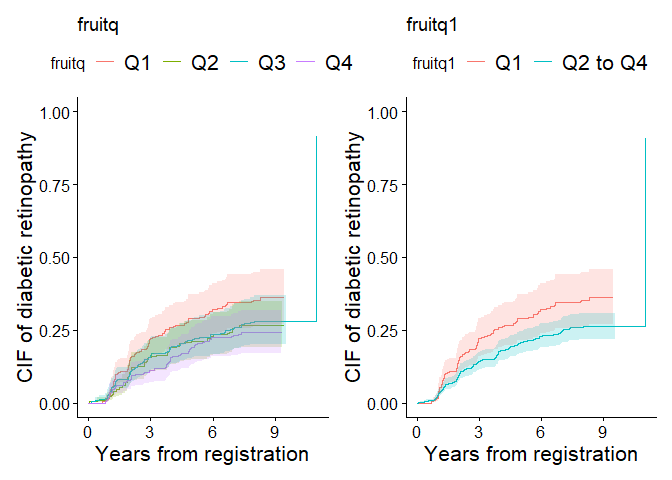
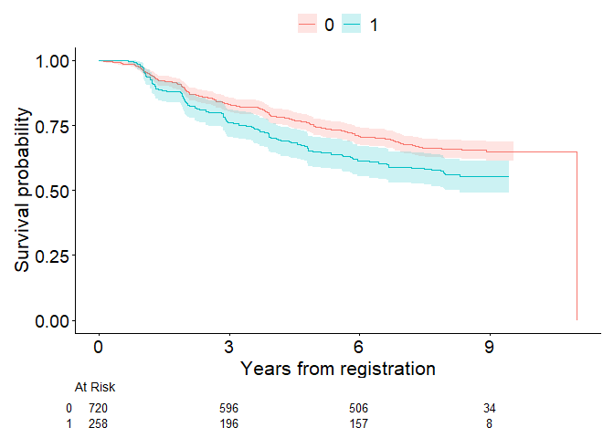

<!-- README.md is generated from README.Rmd. Please edit that file -->

# Visualization and Modeling of Competing Risks in R — cifmodeling

<!-- badges: start -->

<!-- badges: end -->

## Quick start

This package is a compact and unified toolkit for Kaplan–Meier /
Aalen–Johansen curves, visualization, and direct polytomous regression
based on polytomous log odds products in R.

``` r
library(cifmodeling)
data(diabetes.complications)
cifplot(Event(t,epsilon) ~ fruitq, data=diabetes.complications, 
        outcome.type="COMPETING-RISK", printEachEvent=TRUE)
```


This is an example code snippet applying `cifplot()` to create
cumulative incidence function (CIF) curves. In competing risks data,
censoring is often coded as 0, events of interest as 1, and competing
risks as 2. The variable `epsilon` in `diabetes.complications` data
frame represents the occurrence of competing risks according to this
coding scheme. By specifying `printEachEvent=TRUE`, the CIF curve for
diabetic retinopathy (`epsilon=1`) is output on the left, and the CIF
curve for macrovascular complications (`epsilon=2`) is output on the
right.

## Overview

In clinical and epidemiological research, analysts often need to handle
censoring, competing risks, and intercurrent events (e.g., treatment
switching), but existing R packages typically separate these tasks into
different interfaces. `cifmodeling` provides a **unified,
publication-ready toolkit** that integrates description of survival and
CIF curves, regression modeling, and visualization for survival and
competing risks data. It covers both nonparametric estimation and
regression modeling of CIFs, centered around three tightly connected
functions.

- `cifplot()` typically generates a survival or cumulative incidence
  curve with marks that represent censoring, competing risks and
  intercurrent events. Multiple variance estimators and confidence
  interval methods are supported. Visualization relies on
  `ggsurvfit/ggplot2`.

- `cifpanel()` generates a multi-panel figure for survival/CIF curves,
  arranged either in a grid layout or as an inset overlay.

- `polyreg()` fits coherent regression models of CIFs based on
  polytomous log odds products and the stratified IPCW estimator. This
  function is particularly well-suited for causal inference in terms of
  typical effect measures, namely risk ratios, odds ratios, and
  subdistribution hazard ratios, with a competing risks, survival, or
  binary outcome.

These functions adopt a formula + data syntax, return tidy,
publication-ready outputs, and integrate seamlessly with `ggsurvfit` and
`modelsummary` for visualization.

## Quality control

`cifmodeling` includes an extensive test suite built with **testthat**,
ensuring the numerical accuracy and graphical consistency of all core
functions (`cifcurve`, `cifplot`, `cifpanel`, and `polyreg`). The
package is continuously tested on GitHub Actions (Windows, macOS, Linux)
to maintain reproducibility and CRAN-level compliance.

## Installation

The package is implemented in R and relies on `Rcpp`, `nleqslv` and
`boot` for the numerical back-end. The examples in this README also use
`ggplot2`, `ggsurvfit`, `patchwork` and `modelsummary` for tabulation
and plotting. Install the core package and these companion packages
with:

``` r
install.packages("Rcpp")
install.packages("nleqslv")
install.packages("boot")
install.packages("ggplot2")
install.packages("ggsurvfit")
install.packages("patchwork")
install.packages("modelsummary")
devtools::install_github("gestimation/cifmodeling")
```

## Main functions

### cifplot()

This function produces the **Kaplan–Meier survival** or **Aalen–Johansen
cumulative incidence** curve from a unified formula + data interface. It
auto-labels axes based on `outcome.type` and `type.y`, can add
censoring/competing-risk/intercurrent-event marks, and returns a regular
ggplot object (compatible with + and %+%). You may also pass a
survfit-compatible object directly.

**Typical use cases**

- Draw one survival/CIF curve set by exposure groups (e.g., treatment vs
  control).
- Call `cifpanel()` with a simplified code to create a panel displaying
  plots of multiple stratified survival/CIF curves or CIF curves for
  each event type.
- Add confidence intervals and censor/competing-risk/intercurrent-event
  marks.
- Add a risk table to display the number at risk or the estimated
  survival probabilities or CIFs and 95% confidence intervals at each
  point in time.

**Key arguments shared with cifcurve()**

- **Outcome type and estimator**
  - `formula` A model formula specifying the time-to-event outcome on
    the left-hand side (`Event(time, status)` or
    `survfit::Surv(time, status)`) and, optionally, a stratification
    variable on the right-hand side.
  - `outcome.type = "SURVIVAL"` → Kaplan–Meier estimator
  - `outcome.type = "COMPETING-RISK"` → Aalen–Johansen estimator
- **Confidence intervals**
  - `conf.int` sets the two-sided level (default 0.95)  
  - `conf.type` chooses the transformation (`"arcsin"`, `"plain"`,
    `"log"`, `"log-log"`, `"logit"`, or `"none"`)
  - `error` chooses the estimator for standard error (`"greenwood"` or
    `"tsiatis"` for survival curves and `"delta"` or `"aalen"` for CIFs)

**Key arguments for cifplot()**

- **Data visualization**
  - `addConfidenceInterval` adds confidence intervals on the
    ggplot2-based plot
  - `addCompetingRiskMark` and `addIntercurrentEventMark` add symbols to
    describe competing risks or intercurrent events in addition to
    conventional censoring marks with `addCensorMark`
  - `addRiskTable` adds numbers at risk
  - `addEstimateTable` adds estimates and 95% confidence interval
  - `addQuantileLine` adds a line that represents median or quantile
- **Plot customization**
  - `type.y` chooses y-axis. (`"surv"` for survival curves and `"risk"`
    for CIFs)
  - `limits.x`, `limits.y`, `breaks.x`, `breaks.y` numeric vectors for
    axis control
  - `style` specifies the appearance of plot (`"CLASSIC"`, `"BOLD"`,
    `"FRAMED"`, `"GRID"`, `"GRAY"` or `"GGSURVFIT"`)
- **Panel display**
  - `printEachVar` produces multiple survival/CIF curves per
    stratification variable specified in the formula
  - `printEachEvent` produces CIF curves for each event type
  - `printCensoring` produces KM-type curves for (event, censor) and
    (censor, event) so that censoring patterns can be inspected
  - `panel.mode` uses automatic panel mode

**Return**

- A **ggplot** object.

**Under the hood: cifcurve()**

`cifplot()` is a streamlined, opinionated wrapper around `cifcurve()`,
which calculates the Kaplan–Meier estimator and the Aalen–Johansen
estimator. `cifcurve()` returns a survfit-compatible object, enabling an
independent use of standard methods such as:

- `summary()` — time-by-time estimates with standard errors and
  confidence intervals
- `plot()` — base R stepwise survival/CIF curves
- `mean()` — restricted mean survival estimates with confidence
  intervals
- `quantile()` — quantile estimates with confidence intervals

Furthermore, the cifmodeling package provides a workflow for a
**ggplot2-based visualization** based on the survfit-compatible objects
by passing them to `cifplot()` and `cifpanel`.

### cifpanel()

`cifpanel()` arranges multiple `cifplot()/cifcurve()` results into a
unified grid layout with consistent scales, shared legend, and
synchronized themes. It is ideal for visual comparison across outcomes,
time scales, or strata. The inset feature also allows you to display
another plot within a plot.

**Typical use cases** - Compare CIF (event 1) vs CIF (event 2) in a 1×2
layout.

- Compare survival/CIF curves across strata with a shared legend and
  matched axes.

- Display a plot with an enlarged y-axis within a plot scaled from 0 to
  100%.

**Key arguments**

- `formula` or `formulas` — one formula or a list of formulas; each
  entry creates a panel.
- `data`, `outcome.type`, `code.events`, `type.y` — recycled across
  panels unless a list is supplied for per-panel control.
- `rows.columns.panel` — selects grid layout by c(rows, cols).
- `inset.panel` — selects inset layout.
- `title.panel`, `subtitle.panel`, `caption.panel`, `title.plot` —
  overall titles and captions.
- `tag.panel` — panel tag style (e.g., “A”, “a”, “1”).
- `label.x`, `label.y`, `limits.x`, `limits.y`, `breaks.x`, `breaks.y` —
  shared axis control unless a list is supplied for per-panel control.

**Return**

- A **patchwork** object (still ggplot-compatible).

**An example of usage**

In the first example, `cifplot()` called `cifpanel()` to combine
multiple plots. `cifpanel()` is a function for creating a panel with
multiple plots like this. `cifpanel()` can also display one plot inside
another. The cumulative incidence probability for macrovascular
complications is low, making it difficult to discern differences between
groups. The following code uses `inset.panel=` to display plot
`output2`, with an enlarged vertical axis, inside plot `output1`. The
position and size of the zoomed-in-view panel is specified by
`inset.left`, `inset.bottom`, `inset.right`, and `inset.top`.

``` r
output1 <- cifplot(Event(t,epsilon) ~ fruitq,
                   data = diabetes.complications,
                   outcome.type="COMPETING-RISK",
                   code.event1=2,
                   code.event2=1,
                   addConfidenceInterval = FALSE,
                   addRiskTable = FALSE,
                   label.y="CIF of macrovascular complications",
                   label.x="Years from registration")
output2 <- cifplot(Event(t,epsilon) ~ fruitq,
                   data = diabetes.complications,
                   outcome.type="COMPETING-RISK",
                   code.event1=2,
                   code.event2=1,
                   addConfidenceInterval = FALSE,
                   addRiskTable = FALSE,
                   label.y="",
                   label.x="",
                   limits.y=c(0,0.15))
#> [1] "type.y in c"
#> NULL
output3 <- list(a=output1, b=output2)
cifpanel(plots = output3,
         title.plot = c("Fruit intake and macrovascular complications", "Zoomed-in view"),
         inset.panel = TRUE,
         inset.left = 0.40, inset.bottom = 0.45,
         inset.right = 1.00, inset.top = 0.95,
         inset.legend.position = "none",
         legend.position = "bottom")
```


The code below, in which a formula and data is given directly, produces
the same output as above.

``` r
cifpanel(
 title.plot = c("Fruit intake and macrovascular complications", "Zoomed-in view"),
 inset.panel = TRUE,
 formula = Event(t, epsilon) ~ fruitq,
 data = diabetes.complications,
 outcome.type = "COMPETING-RISK",
 code.events = list(c(2,1,0), c(2,1,0)),
 label.y = c("CIF of macrovascular complications", ""),
 label.x = c("Years from registration", ""),
 limits.y = list(c(0,1), c(0,0.15)),
 inset.left = 0.40, inset.bottom = 0.45,
 inset.right = 1.00, inset.top = 0.95,
 inset.legend.position = "none",
 legend.position = "bottom", 
 addConfidenceInterval = FALSE
)
```

### polyreg()

`polyreg()` implements **log odds product modeling** for CIFs at
user-specified time points, focusing on multiplicative effects of a
categorical exposure, or constant effects over time like Cox regression
and Fine-Gray models. It estimates multiplicative effects such as **risk
ratios**, **odds ratios**, or **subdistribution hazard ratios**, while
ensuring that the probabilities across competing events sum to one. This
is achieved through **reparameterization using polytomous log odds
products**, which fits so-called effect-measure models and nuisance
models on multiple competing events simultaneously. Additionally,
`polyreg()` supports direct binomial regression for survival outcomes
and the Richardson model for binomial outcomes, both of which use log
odds products.

The function follows the familiar **formula + data** syntax with
`Event()` or `Surv()` and outputs tidy results, including point
estimates, standard errors, confidence intervals, and p-values. Its
results can be easily summarized with `summary()` or combined with tools
such as **modelsummary** or **broom** for reporting.

**Key arguments**

- `nuisance.model` — a formula describing the outcome and nuisance
  covariates, excluding the exposure of interest.
- `exposure` — specifies the exposure variable. This argument accepts
  one binary or categorical variable.
- `effect.measure1` and `effect.measure2` — specifies the effect
  measures for event1 and event2 (`"RR"`, `"OR"` or `"SHR"`).
- `outcome.type` selects the outcome type (`"COMPETING-RISK"`,
  `"SURVIVAL"`, `"BINOMIAL"`, `"PROPORTIONAL-SURVIVAL"` or
  `"PROPORTIONAL-COMPETING-RISK"`).
- `time.point` — specifies time points at which the exposure effect is
  evaluated. Required for `"COMPETING-RISK"` and `"SURVIVAL"` outcomes.
- `strata` — specifies the stratification variable used to adjust for
  dependent censoring.

**Return**

- `coefficient` — regression coefficients

- `cov` — variance-covariance matrix for regression coefficients

- `diagnostic.statistics` — a data frame containing inverse probability
  weights, influence functions, and predicted potential outcomes

- `summary` — a summary of estimated exposure effects

### An example of usage

``` r
output <- polyreg(nuisance.model=Event(t,epsilon)~1, exposure="fruitq", 
          data=diabetes.complications, effect.measure1="RR", 
          effect.measure2="RR", time.point=8, outcome.type="COMPETING-RISK")
```

If you only need the core functionality of `cifcurve()` and `polyreg()`,
installing `Rcpp` and `nleqslv` are enough; the other packages are
optional but recommended to reproduce the examples below.

## Direct polytomous modeling of CIFs

The model for `polyreg()` is specified by three main components:

- Nuisance model: Describes the relationship between outcomes and
  covariates (excluding exposure).

- Effect measures and time points: Defines the exposure effect to be
  estimated and the time point of interest.

- Censoring adjustment: Specifies strata for inverse probability
  weighting to adjust for dependent censoring.

**1. Nuisance Model**

The `nuisance.model` argument specifies the formula linking the outcome
to covariates. Its format depends on the outcome type:

- Competing risks or survival outcome: Use `Surv()` or `Event()` with
  time and status variables.

- Binomial outcome: Use standard R formula notation.

Default event codes:

- Competing risks outcome: 1 and 2 for event types, 0 for censoring.

- Survival outcome: 1 for events, 0 for censoring.

- Binomial outcome: 0 and 1.

Event codes can be customized using `code.event1`, `code.event2`, and
`code.censoring`. The `outcome.type` argument must be set to:

- Effects on cumulative incidence probabilities at a specific time:
  `"COMPETING-RISK"`

- Effects on a risk at a specific time: `"SURVIVAL"`

- Common effects on cumulative incidence probabilities over time:
  `"PROPORTIONAL-COMPETING-RISK"`

- Common effects on a risk over time: `"PROPORTIONAL-SURVIVAL"`

- Effects on a risk of a binomial outcome: `"BINOMIAL"`

Covariates included in `nuisance.model` should adjust for confounding
factors to obtain unbiased exposure effect estimates.

**2. Effect measures and time points**

Three effect measures available:

- Risk ratio (RR)

- Odds ratio (OR)

- Subdistribution hazard ratio (SHR)

Set the desired measure using `effect.measure1` and, for competing risks
analysis, `effect.measure2`. The `time.point` argument specifies the
follow-up time at which effects are estimated.

**3. Censoring adjustment**

Inverse probability weights adjust for dependent censoring. Use
`strata=` to specify stratification variables. If no strata are
specified, Kaplan-Meier weights are used.

**Return**

This function returns a list object that includes:

- `coefficient` — regression coefficients

- `cov` — variance-covariance matrix for regression coefficients

- `diagnostic.statistics` — a data frame containing inverse probability
  weights, influence functions, and predicted potential outcomes

- `summary` — a summary of estimated exposure effects

Use `summary` output with `msummary()` to display formatted results. The
regression coefficients and their variance-covariance matrix are
provided as `coefficient` and `cov`, respectively, with the first
element corresponding to the intercept term, subsequent elements to the
covariates in `nuisance.model`, and the last element to the variable
specified by `exposure=`. Finally, `diagnostic.statistics` is a data
frame containing inverse probability weights, influence functions, and
predicted values of the potential outcomes of individual observations.

## Example 1. Unadjusted competing risks analysis

For the initial illustration, unadjusted analysis focusing on cumulative
incidence of diabetic retinopathy (event 1) and macrovascular
complications (event 2) at 8 years of follow-up is demonstrated. To
visualize each covariate separately when multiple strata are supplied,
set `printEachVar = TRUE`. Each variable on the right-hand side is
plotted in its own panel, and the layout can be controlled with
`rows.columns.panel`. The figure below contrasts the cumulative
incidence curves of diabetic retinopathy for quartile `fruitq1` and a
binary exposure `fruitq1`, low (Q1) and high (Q2 to 4) intake of fruit,
generated by `cifplot()`. The `addConfidenceInterval=TRUE` argument adds
confidence intervals to the plot. This helps visualize the statistical
uncertainty of estimated probabilities across exposure levels. When
using numeric variables for stratification, discretize them beforehand
with `cut()` or `factor()`. The labels of x-axis (Time) and y-axis
(Cumulative incidence) in these panels are default labels.

``` r
data(diabetes.complications)
diabetes.complications$fruitq1 <- ifelse(
  diabetes.complications$fruitq == "Q1","Q1","Q2 to Q4"
)
cifplot(Event(t,epsilon)~fruitq+fruitq1, data=diabetes.complications, 
        outcome.type="COMPETING-RISK",
        addConfidenceInterval=TRUE, addCensorMark=FALSE, 
        addCompetingRiskMark=FALSE, printEachVar = TRUE)
```



In the second graph, censoring marks are added along each curve
(`addCensorMark = TRUE`) to indicate individuals who were censored
before experiencing any event. These marks visualize the timing and
frequency of censoring, allowing a clearer understanding of
loss-to-censoring patterns over follow-up. Here the workflow differs
slightly from the previous code. First, we compute a survfit-compatible
object `output1` using `cifcurve()` with `outcome.type="COMPETING-RISK"`
by calculating Aalen–Johansen estimator stratified by fruitq1. Then,
`cifplot()` is used to generate the figure. The `label.x` and `label.y`
arguments are also used to customize the axis labels.

``` r
output1 <- cifcurve(Event(t,epsilon)~fruitq1, data=diabetes.complications, 
                    outcome.type="COMPETING-RISK")
cifplot(output1, addConfidenceInterval=FALSE, addEstimateTable=TRUE, 
        addCensorMark=TRUE, addCompetingRiskMark=FALSE, 
        label.y="CIF of diabetic retinopathy", label.x="Years from registration")
```


Next, competing risk marks are added (`addCompetingRiskMark = TRUE`) to
indicate individuals who experienced the competing event (macrovascular
complications) before diabetic retinopathy. The time points at which the
macrovascular complications occurred were obtained as `output2` for each
strata using a helper function `extract_time_to_event()`. These symbols
help distinguish between events due to the primary cause and those
attributable to competing causes. Note that the names of
`competing.risk.time` and `intercurrent.event.time` must match the
strata labels used in the plot if supplied by the user.

``` r
output2 <- extract_time_to_event(Event(t,epsilon)~fruitq1, 
                                 data=diabetes.complications, which_event="event2")
cifplot(output1, addConfidenceInterval=FALSE, addEstimateTable=TRUE, 
        addCensorMark=FALSE, addCompetingRiskMark=TRUE, competing.risk.time=output2, 
        label.y="CIF of diabetic retinopathy", label.x="Years from registration")
```


`label.strata` is an argument for customizing labels, but when inputting
a survfit object, it becomes invalid because it does not contain stratum
information. Therefore, the following code inputs the formula and data.
`label.strata` is used by combining `level.strata` and `order.strata`.
`level.strata` specifies the levels of the stratification variable
corresponding to each label in `label.strata`. The levels specified in
`level.strata` are then displayed in the graph in the order defined by
`order.strata`. A graph enclosed in a square was generated, which is due
to `style="FRAMED"` specification.

``` r
cifplot(Event(t,epsilon)~fruitq1, data=diabetes.complications, 
        outcome.type="COMPETING-RISK", addConfidenceInterval=FALSE, addEstimateTable=TRUE, 
        addCensorMark=FALSE, addCompetingRiskMark=TRUE, competing.risk.time=output2, 
        label.y="CIF of diabetic retinopathy", label.x="Years from registration", 
        label.strata=c("High intake","Low intake"), level.strata=c("Q2 to Q4","Q1"), 
        order.strata=c("Q1", "Q2 to Q4"), style="FRAMED")
```



By specifying `addEstimateTable=TRUE`, the risks of diabetic retinopathy
(estimates for CIFs) along with their confidence interval are shown in
the table at the bottom of each graph. The risk ratios at each time
point may be estimated using `polyreg()` with
`outcome.type="COMPETING-RISK"`. Here, no covariates are included in the
nuisance model (`~1` specifies intercept only). The effect of low fruit
intake `fruitq1` is estimated as an unadjusted risk ratio
(`effect.measure1="RR"`) for diabetic retinopathy (event 1) and
macrovascular complications (event 2) at 8 years (`time.point=8`).

``` r
output3 <- polyreg(nuisance.model=Event(t,epsilon)~1, exposure="fruitq1", 
          data=diabetes.complications, effect.measure1="RR", effect.measure2="RR", 
          time.point=8, outcome.type="COMPETING-RISK", 
          report.nuisance.parameter=TRUE)
print(output3$coefficient)
#> [1] -1.38313159 -0.30043942 -3.99147406 -0.07582595
print(output3$cov)
#>              [,1]         [,2]         [,3]         [,4]
#> [1,]  0.017018160 -0.012351309  0.009609321 -0.008372500
#> [2,] -0.012351309  0.012789187 -0.006012254  0.006540183
#> [3,]  0.009609321 -0.006012254  0.048161715 -0.044070501
#> [4,] -0.008372500  0.006540183 -0.044070501  0.055992232
```

The summaries of analysis results in the list of outputs
(e.g. `output3$summary` below) are compatible with the `modelsummary`
ecosystem, which makes it easy to create publication-ready tables in a
variety of formats. A typical workflow is to pass the `summary` element
of a `polyreg()` fit (or a list of such fits) to
`modelsummary::msummary()`. In this case, all regression coefficients
are included in summary by setting `report.nuisance.parameter = TRUE`.
Model summaries can also be exponentiated to display risk ratios, odds
ratios, or subdistribution hazard ratios using `exponentiate` option.
The summaries can be displayed in the Viewer with customized statistics
such as p-values or confidence intervals.

``` r
msummary(output3$summary, statistic = c("conf.int", "p.value"), exponentiate = TRUE)
```

<table style="width:99%;">
<colgroup>
<col style="width: 32%" />
<col style="width: 44%" />
<col style="width: 22%" />
</colgroup>
<thead>
<tr>
<th></th>
<th>event1</th>
<th>event2</th>
</tr>
</thead>
<tbody>
<tr>
<td>Intercept</td>
<td>0.251</td>
<td>0.018</td>
</tr>
<tr>
<td></td>
<td>[0.194, 0.324]</td>
<td>[0.012, 0.028]</td>
</tr>
<tr>
<td></td>
<td>(&lt;0.001)</td>
<td>(&lt;0.001)</td>
</tr>
<tr>
<td>fruitq1, Q2 to Q4 vs 0</td>
<td>0.740</td>
<td>0.927</td>
</tr>
<tr>
<td></td>
<td>[0.593, 0.924]</td>
<td>[0.583, 1.474]</td>
</tr>
<tr>
<td></td>
<td>(0.008)</td>
<td>(0.749)</td>
</tr>
<tr>
<td>effect.measure</td>
<td>RR at 8</td>
<td>RR at 8</td>
</tr>
<tr>
<td>n.events</td>
<td>279 in N = 978</td>
<td>79 in N = 978</td>
</tr>
<tr>
<td>median.follow.up</td>
<td>8</td>
<td><ul>
<li></li>
</ul></td>
</tr>
<tr>
<td>range.follow.up</td>
<td>[ 0.05 , 11 ]</td>
<td><ul>
<li></li>
</ul></td>
</tr>
<tr>
<td>n.parameters</td>
<td>4</td>
<td><ul>
<li></li>
</ul></td>
</tr>
<tr>
<td>converged.by</td>
<td>Converged in objective function</td>
<td><ul>
<li></li>
</ul></td>
</tr>
<tr>
<td>nleqslv.message</td>
<td>Function criterion near zero</td>
<td><ul>
<li></li>
</ul></td>
</tr>
</tbody>
</table>

## Example 2. Survival analysis

The second example is time to first event analysis
(`outcome.type="SURVIVAL"`) to estimate the effect on the risk of
diabetic retinopathy or macrovascular complications at 8 years. In the
code below, `cifplot()` is directly used to generate a survfit object
internally and plot it.

``` r
diabetes.complications$d <- as.integer(diabetes.complications$epsilon>0)
cifplot(Event(t,d)~fruitq1, data=diabetes.complications, 
outcome.type="SURVIVAL", addConfidenceInterval=TRUE, addCensorMark=FALSE, 
addCompetingRiskMark=FALSE, label.y="Survival probability", 
label.x="Years from registration", label.strata=c("High intake","Low intake"))
```


The code below specifies the Richardson model on the risk of diabetic
retinopathy or macrovascular complications at 8 years
(outcome.type=“SURVIVAL”). Dependent censoring is adjusted by stratified
IPCW method (`strata='strata'`). Estimates other than the effects of
exposure (e.g. intercept) are suppressed when
`report.nuisance.parameter` is not specified.

``` r
output4 <- polyreg(nuisance.model=Event(t,d)~1, 
          exposure="fruitq1", strata="strata", data=diabetes.complications,
          effect.measure1="RR", time.point=8, outcome.type="SURVIVAL")
msummary(output4$summary, statistic=c("conf.int", "p.value"), exponentiate=TRUE)
```

|                        | event 1 (no competing risk)     |
|------------------------|---------------------------------|
| fruitq1, Q2 to Q4 vs 0 | 0.777                           |
|                        | \[0.001, 685.697\]              |
|                        | (0.942)                         |
| effect.measure         | RR at 8                         |
| n.events               | 358 in N = 978                  |
| median.follow.up       | 8                               |
| range.follow.up        | \[ 0.05 , 11 \]                 |
| n.parameters           | 2                               |
| converged.by           | Converged in objective function |
| nleqslv.message        | Function criterion near zero    |
