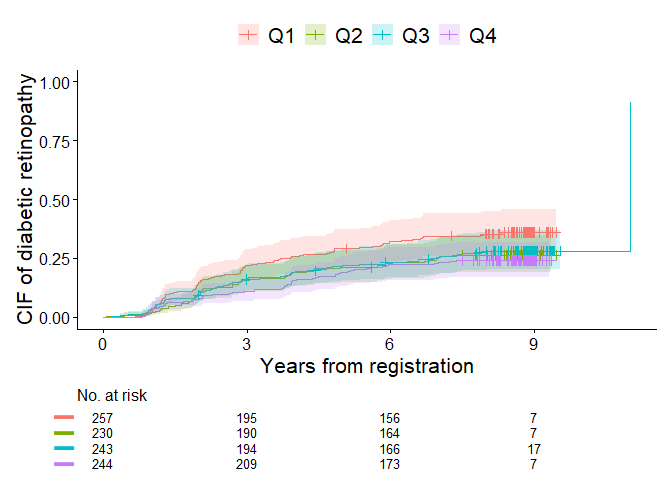
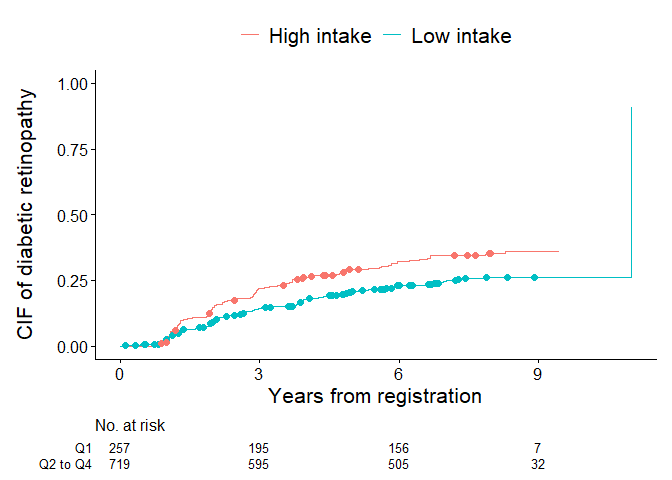

<!-- README.md is generated from README.Rmd. Please edit that file -->

# Package cifmodeling

<!-- badges: start -->

<!-- badges: end -->

## Overview

The cifmodeling package provides a compact and unified toolkit for
survival and competing risks analysis in R. It covers both nonparametric
estimation and regression modeling of cumulative incidence functions
(CIFs).

- `cifcurve()` estimates and visualizes Kaplan–Meier survival or
  Aalen–Johansen cumulative incidence curves with a familiar
  survival::survfit object. Visualization relies on ggsurvfit/ggplot2.

- `polyreg()` performs regression modeling of counting process based on
  polytomous log-odds products and stratified IPCW estimator and
  estimates risk ratios, odds ratios, or subdistribution hazard ratios
  of a categorical exposure.

Both functions adopt a formula + data syntax, return tidy,
publication-ready outputs, and integrate seamlessly with ggsurvfit and
modelsummary for visualization.

## Main functions

### `cifcurve()`

`cifcurve()` estimates **Kaplan–Meier survival** or **Aalen–Johansen
cumulative incidence** functions using a unified interface (model
formula specified by `Surv()` or `Event()`). It returns a
`survfit`-compatible object, so standard methods such as:

- `summary()` — time-by-time estimates with standard errors and
  confidence intervals
- `plot()` — stepwise survival/CIF curves using base graphics
- `quantile()` — confidence intervals

can be used directly.

When `ggsurvfit = TRUE`, the function also generates a **ggplot2-based
visualization** that can be customized like any `ggplot` object. You can
freely add layers, modify themes, or change the axes and legend.

**Key options:**

- **Outcome type and estimator**
  - `outcome.type = "SURVIVAL"` → Kaplan–Meier estimator
  - `outcome.type = "COMPETING-RISK"` → Aalen–Johansen estimator
- **Confidence intervals**
  - `conf.int` sets the two-sided level (default 0.95)  
  - `conf.type` chooses the transformation (`"arcsin"`, `"plain"`,
    `"log"`, `"log-log"`, `"logit"`, or `"none"`)
  - `error` chooses the estimator for standard error (`"greenwood"` or
    `"tsiatis"` for survival curves and “delta”`or`“aalen”\` for CIFs)
- **Visual customization**
  - `addConfidenceInterval` adds confidence intervals on the
    ggplot2-based plot
  - `addIntercurrentEventMark` and `addCensorMark` add symbols to
    describe competing risks or treatment-switch events in addition to
    conventional censoring marks
  - `addRiskTable` adds numbers at risk
  - `ggsurvfit.type` chooses y-axis. (`"surv"` for survival curves and
    `"risk"` for CIFs)
  - Standard `ggplot2` arguments such as `theme()`, `labs()`, and
    `scale_y_continuous()` apply

These defaults mirror the behavior of **ggsurvfit**, allowing
publication-quality plots with minimal code.

### `polyreg()`

`polyreg()` implements **log-odds product modeling** for CIFs at
user-specified time points, focusing on multiplicative effects of a
categorical exposure, or constant effects over time like Cox regression
and Fine-Gray models. It estimates multiplicative effects such as **risk
ratios**, **odds ratios**, or **subdistribution hazard ratios**, while
ensuring that the probabilities across competing events sum to one. This
is achieved through **reparameterization using polytomous log-odds
products**, which fits so-called effect-measure models and nuisance
models on multiple competing events simultaneously. Additionally,
`polyreg()` supports direct binomial regression for survival outcomes
and the Richardson model for binomial outcomes, both of which use log
odds products.

The function follows the familiar **formula + data** syntax with
`Surv()` or `Event()` and outputs tidy results, including point
estimates, standard errors, confidence intervals, and p-values. Its
results can be easily summarized with `summary()` or combined with tools
such as **modelsummary** or **broom** for reporting.

### An example of usage

``` r
data(diabetes.complications)
cifcurve(Event(t,epsilon) ~ fruitq, data=diabetes.complications, 
outcome.type='COMPETING-RISK', error='delta', ggsurvfit.type='risk', 
label.y='CIF of diabetic retinopathy', label.x='Years from registration')
```



    #> Call: cifcurve(formula = Event(t, epsilon) ~ fruitq, data = diabetes.complications, 
    #>     outcome.type = "COMPETING-RISK", error = "delta", ggsurvfit.type = "risk", 
    #>     label.x = "Years from registration", label.y = "CIF of diabetic retinopathy")
    #> 
    #>    records   n events median LCL UCL
    #> Q1     258 257     92     NA  NA  NA
    #> Q2     231 230     61     NA  NA  NA
    #> Q3     244 243     69     11  NA  NA
    #> Q4     245 244     59     NA  NA  NA
    output <- polyreg(nuisance.model=Event(t,epsilon) ~ +1, exposure='fruitq', 
              data=diabetes.complications, effect.measure1='RR', 
              effect.measure2='RR', time.point=8, outcome.type='COMPETING-RISK')

## Installation

The package is implemented in R and relies on `Rcpp`, `nleqslv` and
`boot` for the numerical back-end. The examples in this README also use
`modelsummary`, `ggplot2`, and `ggsurvfit` for tabulation and plotting.
Install the core package and these companion packages with:

``` r
install.packages("Rcpp")
install.packages("nleqslv")
install.packages("boot")
install.packages("ggplot2")
install.packages("ggsurvfit")
install.packages("modelsummary")
devtools::install_github("gestimation/cif")
```

If you only need the core functionality of `cif`, installing `Rcpp` and
`nleqslv` are enough; the other packages are optional but recommended to
reproduce the examples below.

## Model specification of polyreg()

The model for polyreg() is specified by three main components:

- Nuisance model: Describes the relationship between outcomes and
  covariates (excluding exposure).

- Effect measures and time points: Defines the exposure effect to be
  estimated and the time point of interest.

- Censoring adjustment: Specifies strata for inverse probability
  weighting to adjust for dependent censoring.

### 1. Nuisance Model

The nuisance.model argument specifies the formula linking the outcome to
covariates. Its format depends on the outcome type:

- Competing risks or survival outcome: Use Surv() or Event() with time
  and status variables.

- Binomial outcome: Use standard R formula notation.

Default event codes:

- Competing risks outcome: 1 and 2 for event types, 0 for censored
  observations.

- Survival outcome: 1 for events, 0 for censored observations.

- Binomial outcome: 0 and 1.

Event codes can be customized using code.event1, code.event2, and
code.censoring. The outcome.type argument must be set to:

- Effects on cumulative incidence probabilities at a specific time:
  ‘COMPETING-RISK’

- Effects on a risk at a specific time: ‘SURVIVAL’

- Common effects on cumulative incidence probabilities over time:
  ‘POLY-PROPORTIONAL’

- Common effects on a risk over time: ‘PROPORTIONAL’

- Effects on a risk of a binomial outcome: ‘BINOMIAL’

Covariates included in nuisance.model should adjust for confounding
factors to obtain unbiased exposure effect estimates.

### 2. Effect measures and time points

Three effect measures available:

- Risk Ratio (RR)

- Odds Ratio (OR)

- Subdistribution Hazard Ratio (SHR)

Set the desired measure using effect.measure1 and, for competing risks
analysis, effect.measure2. The time.point argument specifies the
follow-up time at which effects are estimated.

### 3. Censoring adjustment

Inverse probability weights adjust for dependent censoring. Use
`strata=` to specify stratification variables. If no strata are
specified, Kaplan-Meier weights are used.

## Output

The main components of the output list include:

- coefficient: Regression coefficients

- cov: Variance-covariance matrix

- diagnosis.statistics: Inverse probability weights, influence
  functions, and predicted potential outcomes

- summary: Summary of estimated exposure effects

Use the summary output with `msummary()` to display formatted results.
The regression coefficients and their variance-covariance matrix are
provided as coefficient and cov, respectively, with the first element
corresponding to the intercept term, subsequent elements to the
covariates in nuisance.model, and the last element to exposure. Finally,
diagnosis.statistics is a dataset containing inverse probability
weights, influence functions, and predicted values of the potential
outcomes of individual observations.

## Example 1. Unadjusted competing risks analysis

For the initial illustration, unadjusted analysis focusing on cumulative
incidence probabilities of diabetic retinopathy (event 1) and
macro-vascular complications (event 2) at 8 years of follow-up is
demonstrated. The figure below shows cumulative incidence of diabetic
retinopathy for low (Q1) and high (Q2 to 4) intake of fruit. This is
generated using `cifcurve()` with `outcome.type='COMPETING-RISK'` by
calculating Aalen–Johansen estimator stratified by fruitq1. The
`ggsurvfit.type='risk'` option sets the y-axis to display cumulative
incidence probabilities. The `label.x` and `label.y` arguments customize
the axis labels, and `label.strata` provides custom labels for the
strata in the legend. The `addConfidenceInterval=TRUE` argument adds
confidence intervals to the plot, while `error='delta'` specifies the
delta method for variance estimation. This helps visualize the
statistical uncertainty of estimated probabilities across exposure
levels.

``` r
data(diabetes.complications)
cifcurve(Event(t,epsilon) ~ fruitq1, data=diabetes.complications, 
outcome.type='COMPETING-RISK', error='delta', ggsurvfit.type='risk', 
addConfidenceInterval=TRUE, addCensorMark=FALSE, addCompetingRiskMark=FALSE, 
label.y='CIF of diabetic retinopathy', label.x='Years from registration', 
label.strata=c('High intake','Low intake'))
```


    #> Call: cifcurve(formula = Event(t, epsilon) ~ fruitq1, data = diabetes.complications, 
    #>     outcome.type = "COMPETING-RISK", error = "delta", ggsurvfit.type = "risk", 
    #>     addConfidenceInterval = TRUE, addCensorMark = FALSE, addCompetingRiskMark = FALSE, 
    #>     label.x = "Years from registration", label.y = "CIF of diabetic retinopathy", 
    #>     label.strata = c("High intake", "Low intake"))
    #> 
    #>             records   n events median LCL UCL
    #> High intake     720 719    189     11  NA  NA
    #> Low intake      258 257     92     NA  NA  NA

In the next figure, censoring marks are added along each curve
(addCensorMark = TRUE) to indicate individuals who were censored before
experiencing any event. These marks visualize the timing and frequency
of censoring, allowing a clearer understanding of loss-to-censoring
patterns over follow-up.

``` r
cifcurve(Event(t,epsilon) ~ fruitq1, data=diabetes.complications, 
outcome.type='COMPETING-RISK', error='delta', ggsurvfit.type='risk', 
addConfidenceInterval=FALSE, addCensorMark=TRUE, addCompetingRiskMark=FALSE, 
label.y='CIF of diabetic retinopathy', label.x='Years from registration', 
label.strata=c('High intake','Low intake'))
```


    #> Call: cifcurve(formula = Event(t, epsilon) ~ fruitq1, data = diabetes.complications, 
    #>     outcome.type = "COMPETING-RISK", error = "delta", ggsurvfit.type = "risk", 
    #>     addConfidenceInterval = FALSE, addCensorMark = TRUE, addCompetingRiskMark = FALSE, 
    #>     label.x = "Years from registration", label.y = "CIF of diabetic retinopathy", 
    #>     label.strata = c("High intake", "Low intake"))
    #> 
    #>             records   n events median LCL UCL
    #> High intake     720 719    189     11  NA  NA
    #> Low intake      258 257     92     NA  NA  NA

In the final figure, competing risk marks are added
(addCompetingRiskMark = TRUE) to indicate individuals who experienced
the competing event (macrovascular complications) before diabetic
retinopathy. These symbols help distinguish between events due to the
primary cause and those attributable to competing causes.

``` r
cifcurve(Event(t,epsilon) ~ fruitq1, data=diabetes.complications, 
outcome.type='COMPETING-RISK', error='delta', ggsurvfit.type='risk', 
addConfidenceInterval=FALSE, addCensorMark=FALSE, addCompetingRiskMark=TRUE, 
label.y='CIF of diabetic retinopathy', label.x='Years from registration', 
label.strata=c('High intake','Low intake'))
```



    #> Call: cifcurve(formula = Event(t, epsilon) ~ fruitq1, data = diabetes.complications, 
    #>     outcome.type = "COMPETING-RISK", error = "delta", ggsurvfit.type = "risk", 
    #>     addConfidenceInterval = FALSE, addCensorMark = FALSE, addCompetingRiskMark = TRUE, 
    #>     label.x = "Years from registration", label.y = "CIF of diabetic retinopathy", 
    #>     label.strata = c("High intake", "Low intake"))
    #> 
    #>             records   n events median LCL UCL
    #> High intake     720 719    189     11  NA  NA
    #> Low intake      258 257     92     NA  NA  NA

An estimate of the unadjusted risk ratio for the risk of diabetic
retinopathy at 8 years is obtained using `polyreg()` with
`outcome.type='COMPETING-RISK'`. Here, no covariates are included in the
nuisance model (intercept only). The effect of low fruit intake
(fruitq1) is estimated as a risk ratio (effect.measure1=‘RR’) for
diabetic retinopathy (event 1) and macrovascular complications (event 2)
at 8 years (time.point=8).

``` r
output <- polyreg(nuisance.model=Event(t,epsilon) ~ +1, exposure='fruitq1', 
          data=diabetes.complications, effect.measure1='RR', effect.measure2='RR', 
          time.point=8, outcome.type='COMPETING-RISK', 
          report.nuisance.parameter=TRUE)
print(output$coefficient)
#> [1] -1.38313159  0.30043942 -3.99147405  0.07582595
print(output$cov)
#>              [,1]         [,2]         [,3]         [,4]
#> [1,]  0.007502655 -0.004520362  0.003142563 -0.002206020
#> [2,] -0.004520362  0.009639432 -0.001175043  0.004587626
#> [3,]  0.003142563 -0.001175043  0.019007718 -0.016913815
#> [4,] -0.002206020  0.004587626 -0.016913815  0.054837284
```

The summaries of analysis results in the list of outputs
(e.g. output\$summary below) are compatible with the `modelsummary`
ecosystem, which makes it easy to create publication-ready tables in a
variety of formats. A typical workflow is to pass the `summary` element
of a `polyreg()` fit (or a list of such fits) to
`modelsummary::msummary()`. In this case, all regression coefficients
are included in summary by setting `report.nuisance.parameter = TRUE`.
Model summaries can also be exponentiated to display risk ratios, odds
ratios, or sub-distribution hazard ratios using the exponentiate option.
The summaries can be displayed in the Viewer with customized statistics
such as p-values or confidence intervals.

``` r
msummary(output$summary, statistic = c("conf.int", "p.value"), exponentiate = TRUE)
```

<table style="width:97%;">
<colgroup>
<col style="width: 26%" />
<col style="width: 47%" />
<col style="width: 23%" />
</colgroup>
<thead>
<tr>
<th></th>
<th>event1</th>
<th>event2</th>
</tr>
</thead>
<tbody>
<tr>
<td>Intercept</td>
<td>0.251</td>
<td>0.018</td>
</tr>
<tr>
<td></td>
<td>[0.212, 0.297]</td>
<td>[0.014, 0.024]</td>
</tr>
<tr>
<td></td>
<td>(&lt;0.001)</td>
<td>(&lt;0.001)</td>
</tr>
<tr>
<td>fruitq1, 1 vs 0</td>
<td>1.350</td>
<td>1.079</td>
</tr>
<tr>
<td></td>
<td>[1.114, 1.637]</td>
<td>[0.682, 1.707]</td>
</tr>
<tr>
<td></td>
<td>(0.002)</td>
<td>(0.746)</td>
</tr>
<tr>
<td>effect.measure</td>
<td>RR at 8</td>
<td>RR at 8</td>
</tr>
<tr>
<td>n.events</td>
<td>279 in N = 978</td>
<td>79 in N = 978</td>
</tr>
<tr>
<td>median.follow.up</td>
<td>8</td>
<td><ul>
<li></li>
</ul></td>
</tr>
<tr>
<td>range.follow.up</td>
<td>[ 0.05 , 11 ]</td>
<td><ul>
<li></li>
</ul></td>
</tr>
<tr>
<td>n.parameters</td>
<td>4</td>
<td><ul>
<li></li>
</ul></td>
</tr>
<tr>
<td>converged.by</td>
<td>Converged in objective function</td>
<td><ul>
<li></li>
</ul></td>
</tr>
<tr>
<td>nleqslv.message</td>
<td>Function criterion near zero</td>
<td><ul>
<li></li>
</ul></td>
</tr>
</tbody>
</table>

## Example 2. Survival analysis

The second example is time to first event analysis
(`outcome.type='SURVIVAL'`) to estimate the effect on the risk of
diabetic retinopathy or macrovascular complications at 8 years.

``` r
data(diabetes.complications)
diabetes.complications$d <- (diabetes.complications$epsilon>0)
cifcurve(Event(t,d) ~ fruitq1, data=diabetes.complications, 
outcome.type='SURVIVAL', addConfidenceInterval=TRUE, addCensorMark=FALSE, 
addCompetingRiskMark=FALSE, label.y='Survival probability', 
label.x='Years from registration', label.strata=c('High intake','Low intake'))
```


    #> Call: cifcurve(formula = Event(t, d) ~ fruitq1, data = diabetes.complications, 
    #>     outcome.type = "SURVIVAL", addConfidenceInterval = TRUE, 
    #>     addCensorMark = FALSE, addCompetingRiskMark = FALSE, label.x = "Years from registration", 
    #>     label.y = "Survival probability", label.strata = c("High intake", 
    #>         "Low intake"))
    #> 
    #>               n events median LCL UCL
    #> High intake 720    248     11  NA  NA
    #> Low intake  258    114     NA 8.3  NA

The code below specifies the Richardson model on the risk of diabetic
retinopathy or macrovascular complications at 8 years
(outcome.type=‘SURVIVAL’). Dependent censoring is adjusted by stratified
IPCW method (`strata='strata'`). Estimates other than the effects of
exposure (e.g. intercept) are suppressed when
`report.nuisance.parameter` is not specified.

``` r
output <- polyreg(nuisance.model=Event(t,d) ~ +1, 
          exposure='fruitq1', strata='strata', data=diabetes.complications,
          effect.measure1='RR', time.point=8, outcome.type='SURVIVAL')
msummary(output$summary, statistic=c("conf.int", "p.value"), exponentiate=TRUE)
```

|                  | event 1 (no competing risk)     |
|------------------|---------------------------------|
| fruitq1, 1 vs 0  | 1.288                           |
|                  | \[1.085, 1.529\]                |
|                  | (0.004)                         |
| effect.measure   | RR at 8                         |
| n.events         | 358 in N = 978                  |
| median.follow.up | 8                               |
| range.follow.up  | \[ 0.05 , 11 \]                 |
| n.parameters     | 2                               |
| converged.by     | Converged in objective function |
| nleqslv.message  | Function criterion near zero    |

## Example 3. Adjusted competing risks analysis

The code below specifies polytomous log-odds models of both of competing
events (outcome.type=‘COMPETING-RISK’). Here 15 covariates and censoring
strata are specified in `nuisance.model=` and `strata=`, respectively.

``` r
output <- polyreg(nuisance.model = Event(t,epsilon) ~ age+sex+bmi+hba1c
          +diabetes_duration+drug_oha+drug_insulin+sbp+ldl+hdl+tg
          +current_smoker+alcohol_drinker+ltpa, 
          exposure='fruitq1', strata='strata', data=diabetes.complications,
          effect.measure1='RR', time.point=8, outcome.type='COMPETING-RISK')
```

Only the regression coefficient of exposure is included in summary, so
now model summary does not display parameters of the covariates other
than exposure.

``` r
msummary(output$summary, statistic=c("conf.int", "p.value"), exponentiate=TRUE)
```

<table style="width:97%;">
<colgroup>
<col style="width: 26%" />
<col style="width: 47%" />
<col style="width: 23%" />
</colgroup>
<thead>
<tr>
<th></th>
<th>event1</th>
<th>event2</th>
</tr>
</thead>
<tbody>
<tr>
<td>fruitq1, 1 vs 0</td>
<td>1.552</td>
<td>0.909</td>
</tr>
<tr>
<td></td>
<td>[1.331, 1.810]</td>
<td>[0.493, 1.676]</td>
</tr>
<tr>
<td></td>
<td>(&lt;0.001)</td>
<td>(0.761)</td>
</tr>
<tr>
<td>effect.measure</td>
<td>RR at 8</td>
<td>RR at 8</td>
</tr>
<tr>
<td>n.events</td>
<td>279 in N = 978</td>
<td>79 in N = 978</td>
</tr>
<tr>
<td>median.follow.up</td>
<td>8</td>
<td><ul>
<li></li>
</ul></td>
</tr>
<tr>
<td>range.follow.up</td>
<td>[ 0.05 , 11 ]</td>
<td><ul>
<li></li>
</ul></td>
</tr>
<tr>
<td>n.parameters</td>
<td>32</td>
<td><ul>
<li></li>
</ul></td>
</tr>
<tr>
<td>converged.by</td>
<td>Converged in objective function</td>
<td><ul>
<li></li>
</ul></td>
</tr>
<tr>
<td>nleqslv.message</td>
<td>Function criterion near zero</td>
<td><ul>
<li></li>
</ul></td>
</tr>
</tbody>
</table>

## Additional information

### Comparison of `model formula` and `outcome.type` across `cifcurve()` and `polyreg()`

**Common ground**

- Both functions expect a `Surv()` or `Event()` response on the
  left-hand side of the model formula so that follow-up time and event
  indicators are supplied in the same way. Internally the helpers
  validate non-negative times, check that the event codes match the
  user-specified `code.event*` arguments, and derive indicators used
  downstream.
- The `outcome.type` argument is normalized by the same utility, meaning
  that the same set of synonyms (e.g. `"C"`, `"competing risk"`, or
  `"S"`) are accepted in both workflows and mapped onto the canonical
  labels used in the estimators.

**Key differences**

- In `cifcurve()` the right-hand side of the formula defines the
  grouping variable(s) whose curves are estimated; weights (if any) are
  supplied separately. There is no dedicated exposure argument because
  all strata are handled through the formula term that is turned into a
  factor for plotting and estimation.
- In `polyreg()` the `nuisance.model` formula describes only the outcome
  and nuisance covariates (i.e. confounders), while the exposure is
  passed separately through the `exposure` argument. The exposure design
  matrix, reference level handling, and scaling of nuisance covariates
  are handled explicitly for regression fitting.
- `cifcurve()` focuses on two estimands, selecting between Kaplan–Meier
  and Aalen–Johansen calculations via `outcome.type = "SURVIVAL"` or
  `"COMPETING-RISK"`. In contrast, `polyreg()` supports additional
  time-constant and binomial estimands (`"PROPORTIONAL"`,
  `"POLY-PROPORTIONAL"`, `"BINOMIAL"`) and enforces time-point
  requirements accordingly—for example `time.point` is mandatory for
  survival/competing-risk contrasts, while time-constant-effect models
  can infer all event time or a use-specified grid of time passing a
  vector using `time.point`.

### Processing pipeline of`cifcurve()`

A user-specified model formula is first parsed by `readSurv()` to
extract the time-to-event, the event indicator, optional weights, and
any strata variable. Those components are then passed to the back-end
estimators implemented in `src/calculateKM.cpp`. The C++ routine
supports both weighted and stratified data, so the heavy lifting for
Kaplan–Meier estimates (and associated at-risk, event, and censor
counts) happens efficiently regardless of how the input was specified.
For competing-risks data, `cifcurve()` builds
inverse-probability-of-censoring weights to calculate Aalen–Johansen
estimates by calling `calculateAJ()`, which reuses the Kaplan–Meier
estimates for censoring from `calculateKM()`.

The `error` argument determines how standard errors are computed. For
survival data (`outcome.type = "SURVIVAL"`) it maps to Greenwood or
Tsiatis estimators inside `calculateKM()`, while competing-risks data
(`outcome.type = "COMPETING-RISK"`) delegates to
`calculateAalenDeltaSE()` where `"aalen"` reproduces the classic Aalen
variance and `"delta"` implements the delta method. Standard errors are
passed to `calculateCI()`, which also provides the requested
transformation-based confidence bounds.

### Variance and confidence interval options for `cifcurve()`

**Standard errors.** For standard errors of Kaplan–Meier estimator, the
default is Greenwood estimator, with alternatives `"tsiatis"` for the
Tsiatis estimator The Greenwood formula is a sum of terms d/(n(n-m)),
where d is the number of events at a given time point, n is the number
at risk, and m is the cumulative sum of events at that time. This
formula is derived from a binomial argument, so extension to the
weighted case is ad hoc. Tsiatis (1981) proposes a sum of terms
d/(n\*n), based on a counting process argument which includes the
weighted case. For a confidence band of cumulative incidence curves, the
default `"delta"` applies the delta-method, while `"aalen"` uses the
Aalen variance decomposition. By default `cifcurve()` rescales the
Greenwood/Tsiatis quantities so that `std.err` is reported on the
probability scale; set `report.survfit.std.err = TRUE` to return the
conventional log-survival standard errors from `survfit`.

**Confidence intervals.** `calculateCI()` constructs intervals on the
probability scale using the requested transformation:
`"arcsine-square root"`/`"arcsine"`/`"a"` (default), `"plain`, `"log"`,
`"log-log"`, or `"logit"`. Passing `"none"`/`"n"` skips interval
computation entirely. The function exponentiates back to the probability
scale, clips bounds to \[0, 1\], and replaces undefined values with `NA`
so that interval endpoints remain well behaved in plots and summaries.

### Processing pipeline of `polyreg()`

Input pre-processing mirrors the survival workflow by calling
`checkInput()` to parse event codes, exposure levels, and requested
estimands before `createAnalysisDataset()` builds the modelling frame
and `normalizeCovariate()` rescales covariates by default. Starting
values are obtained from the nuisance model fits via
`getInitialValues()` or `getInitialValuesProportional()`, or, when
necessary, from user-supplied data frame of starting values.
Inverse-probability-of-censoring weights for survival and
competing-risks outcomes are calculated by `calculateIPCW()`, which in
turn wraps the `calculateKM()` C++ routine to obtain Kaplan-Meier
estimates of censoring, while time-constant effects assemble matrices
through `calculateIPCWMatrix()`.

The weighted estimating equations are then solved by
`solveEstimatingEquation()`, which dispatches to specific score
functions such as `estimating_equation_ipcw()`,
`estimating_equation_survival()`, and
`estimating_equation_proportional()` and iterates with
`nleqslv`/Levenberg–Marquardt updates until the convergence criteria in
`assessConvergence()` are met. Sandwich variances come from
`calculateCov()` or `calculateCovSurvival()` and are rescaled back to
the original covariate scale by `normalizeEstimate()`, while optional
bootstrap intervals reuse the same solver inside the `boot` resampling
loop. The resulting influence functions, weights, and fitted cumulative
incidence probabilities are retained in `diagnosis.statistics` for
downstream diagnostics.

### Key arguments of `msummary()` that are helpful when reporting `polyreg()` results

- `output` – controls the destination of the table (e.g., `"markdown"`,
  `"latex"`, `"html"`, or a file path such as
  `'results/cif_table.docx'`).
- `coef_map` or `coef_rename` – renames model terms for
  interpretability.
- `statistic` – specifies which uncertainty estimates to display. For
  example, `statistic = "p.value"` shows p-values instead of standard
  errors.

You can also supply multiple model summaries as a named list to compare
estimates across specifications in a single table. See
`vignette('modelsummary')` for a comprehensive overview of additional
layout and styling options.
