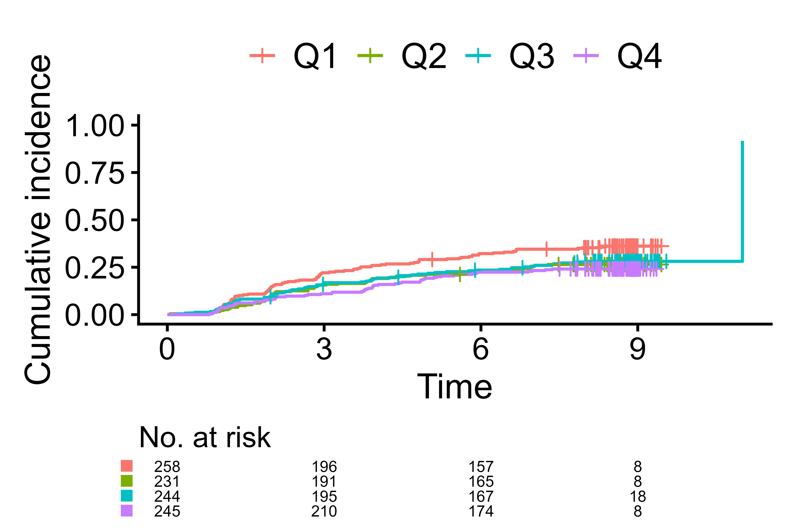

# Gallery

### Default for survival data

``` r

data(diabetes.complications)
diabetes.complications$d <- as.integer(diabetes.complications$epsilon>0)
diabetes.complications$fruitq1 <- ifelse(
  diabetes.complications$fruitq == "Q1","Q1","Q2 to Q4"
)

cifplot(Event(t,d) ~ fruitq1,
        data                    = diabetes.complications,
        outcome.type            = "survival")
```


Default of cifplot() for survival data

### Default for competing risks data

``` r

cifplot(Event(t,epsilon) ~ fruitq1,
        data                    = diabetes.complications,
        outcome.type            = "competing-risk")
```


Default of cifplot() for competing risks data

### Visual elements

``` r

cifplot(Event(t,epsilon) ~ fruitq1,
        data                    = diabetes.complications,
        outcome.type            = "competing-risk",
        add.conf                = FALSE, 
        add.risktable           = FALSE, 
        add.censor.mark         = FALSE)
```


Hide confidence interval, risk table, and censor marks

``` r

cifplot(Event(t,epsilon) ~ fruitq1,
        data                    = diabetes.complications,
        outcome.type            = "competing-risk",
        add.risktable           = FALSE, 
        add.estimate.table      = TRUE, 
        add.censor.mark         = FALSE, 
        add.competing.risk.mark = TRUE)
```


Add a table of CIF estimates and event-2 time marks

``` r

# Extract event-2 time from data frame
time_to_event <- extract_time_to_event(Event(t, epsilon) ~ fruitq1,
                                       data = diabetes.complications, 
                                       which.event = "event2")

# Ensure named list by strata
stopifnot(is.list(time_to_event), length(time_to_event) > 0)

# Add event-2 time marks using external event-2 time 
cifplot(Event(t, epsilon) ~ fruitq1,
        data                    = diabetes.complications,
        outcome.type            = "competing-risk",
        add.risktable           = FALSE,
        add.estimate.table      = TRUE,
        add.censor.mark         = FALSE,
        add.competing.risk.mark = TRUE,
        competing.risk.time     = time_to_event)
```


Add event-2 time marks using external event-2 time

``` r

cifplot(Event(t, epsilon) ~ fruitq1,
        data                      = diabetes.complications,
        outcome.type              = "competing-risk",
        add.risktable             = FALSE,
        add.estimate.table        = TRUE,
        symbol.risk.table         = "circle", 
        add.censor.mark           = FALSE,
        add.competing.risk.mark   = TRUE,
        shape.competing.risk.mark = 1,
        size.competing.risk.mark  = 4,
        competing.risk.time       = time_to_event)
```


Use (open) circle for strata in estimate table and event-2 time marks

### Risk ratio label

``` r

# Fit direct polytomous regression
output1 <- polyreg(nuisance.model=Event(t,epsilon)~1, exposure="fruitq1", 
          data=diabetes.complications, effect.measure1="RR", effect.measure2="RR", 
          time.point=8, outcome.type="competing-risk")

# Create a label of the risk ratio of event1
output2 <- effect_label.polyreg(output1, 
                              event="event1",
                              add.exposure.levels=FALSE, 
                              add.outcome=FALSE, 
                              add.conf=FALSE)
output3 <- cifplot(Event(t,epsilon) ~ fruitq1,
        data                    = diabetes.complications,
        outcome.type            = "competing-risk")

# Add the label
output4 <- output3$plot + ggplot2::annotate("text", x=6, y=0.8, 
                                            label=output2, hjust=1, vjust=1)
print(output4)
```


Add risk ratio label using polyreg() and effect_label.polyreg()

### Panel mode

``` r

cifplot(Event(t,epsilon) ~ fruitq + fruitq1,
        data                      = diabetes.complications,
        outcome.type              = "competing-risk",
        panel.per.variable        = TRUE)
```


Cumulative incidence curves per each stratification variable

``` r

cifplot(Event(t,epsilon) ~ fruitq1,
        data                      = diabetes.complications,
        outcome.type              = "competing-risk",
        panel.per.event           = TRUE)
```


Cumulative incidence curves for event 1 vs event 2

``` r

cifplot(Event(t,d) ~ fruitq1,
        data                      = diabetes.complications,
        outcome.type              = "survival",
        panel.censoring           = TRUE)
```


Survival curves for event vs censoring

### Zoomed-in-view

``` r

output5 <- cifpanel(
 title.plot = c("Fruit intake and macrovascular complications", "Zoomed-in view"),
 inset.panel           = TRUE,
 formula               = Event(t, epsilon) ~ fruitq,
 data                  = diabetes.complications,
 outcome.type          = "competing-risk",
 code.events           = list(c(2,1,0), c(2,1,0)),
 label.y               = c("CIF of macrovascular complications", ""),
 label.x               = c("Years from registration", ""),
 limits.y              = list(c(0,1), c(0,0.15)),
 inset.left            = 0.40, 
 inset.bottom          = 0.45,
 inset.right           = 1.00, 
 inset.top             = 0.95,
 inset.legend.position = "none",
 legend.position       = "bottom", 
 add.conf              = FALSE
)
print(output5)
```


Zoomed-in-view panel using cifpanel()

### Font, style and palette

``` r

cifplot(Event(t,epsilon) ~ fruitq,
        data                      = diabetes.complications,
        outcome.type              = "competing-risk",
        add.conf                  = FALSE, 
        font.size                 = 16, 
        font.size.risk.table      = 3)
```



Adjust font size

``` r

cifplot(Event(t,epsilon) ~ fruitq,
        data                      = diabetes.complications,
        outcome.type              = "competing-risk",
        add.conf                  = FALSE, 
        style                     = "bold", 
        font.family               = "serif", 
        palette                   = c("blue1", "cyan3", "navy", "deepskyblue3"))
```


Select font family, style, linewidth and palette

``` r

cifplot(Event(t,epsilon) ~ fruitq,
        data                      = diabetes.complications,
        outcome.type              = "competing-risk",
        add.conf = FALSE, 
        style                     = "framed", 
        font.family               = "serif", 
        linewidth                 = 1.3, 
        linetype                  = TRUE, 
        palette                   = c("azure4", "gray", "black", "darkgray"))
```


Select font family, style, linewidth and palette

``` r

cifplot(Event(t,epsilon) ~ fruitq,
        data                      = diabetes.complications,
        outcome.type              = "competing-risk",
        add.conf                  = FALSE, 
        style                     = "gray", 
        font.family               = "mono", 
        palette                   = c("cyan3", "deepskyblue4", "darkseagreen2", "deepskyblue3"))
```


Select font family, style, linewidth and palette

``` r

cifplot(Event(t,epsilon) ~ fruitq,
        data                      = diabetes.complications,
        outcome.type              = "competing-risk",
        add.conf                  = FALSE, 
        style                     = "ggsurvfit", 
        font.family               = "mono", 
        palette                   = c("brown", "orange", "purple", "darkgoldenrod"))
```


Select font family, style, linewidth and palette

### Axis and label

``` r

cifplot(Event(t,d) ~ fruitq1,
        data                      = diabetes.complications,
        outcome.type              = "survival",
        label.y                   = "Survival (no complications)",
        label.x                   = "Years from registration",
        label.strata              = c("High intake","Low intake"), 
        level.strata              = c("Q2 to Q4","Q1"), 
        order.strata              = c("Q1", "Q2 to Q4"))
```


Customize labels with explicit level mapping (safe against factor order)

``` r

cifplot(Event(t,d) ~ fruitq1,
        data                      = diabetes.complications,
        outcome.type              = "survival",
        label.y                   = "Risk of diabetes complications",
        label.x                   = "Years from registration",
        label.strata              = c("High intake","Low intake"), 
        level.strata              = c("Q2 to Q4","Q1"), 
        order.strata              = c("Q1", "Q2 to Q4"),
        type.y                    = "risk",
        limits.y                  = c(0, 0.5),
        breaks.y                  = seq(0, 0.5, by=0.1),
        limits.x                  = c(0, 8),
        breaks.x                  = 0:8,
        use.coord.cartesian       = TRUE) 
```


Plot 1 - survival and set axis limits

### Proportional hazards check by a log-log plot

``` r

cifplot(Event(t,d) ~ fruitq1,
        data                      = diabetes.complications,
        outcome.type              = "survival",
        type.y                    = "cloglog")
```


Check the proportional hazards assumption by a log-log plot
