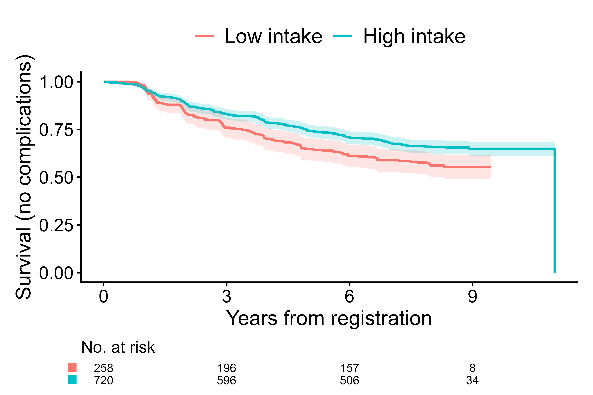

# Examples

## Example 1. Unadjusted competing risks analysis

For the initial illustration, unadjusted analysis focusing on cumulative
incidence of diabetic retinopathy (event 1) and macrovascular
complications (event 2) at 8 years of follow-up is demonstrated. **To
visualize each stratification variable separately**, set
`panel.per.variable = TRUE`. Each variable on the right-hand side is
plotted in its own panel, and the layout can be controlled with
`rows.columns.panel`. The figure below contrasts the cumulative
incidence curves of diabetic retinopathy for the quartiles `fruitq` and
a binary exposure `fruitq1`, low (Q1) and high (Q2 to 4) intake of
fruit, generated by
[`cifplot()`](https://gestimation.github.io/cifmodeling/reference/cifplot.md).
The `add.conf=TRUE` argument adds confidence intervals to the plot. This
helps visualize the statistical uncertainty of estimated probabilities
across exposure levels. When using s continuous variable for
stratification, discretize them beforehand with
[`cut()`](https://rdrr.io/r/base/cut.html) or
[`factor()`](https://rdrr.io/r/base/factor.html). The labels of x-axis
(Time) and y-axis (Cumulative incidence) in these panels are default
labels.

``` r

data(diabetes.complications)
diabetes.complications$fruitq1 <- ifelse(
  diabetes.complications$fruitq == "Q1","Q1","Q2 to Q4"
)
cifplot(Event(t,epsilon)~fruitq+fruitq1, data=diabetes.complications, 
        outcome.type="competing-risk",
        add.conf=TRUE, add.censor.mark=FALSE, 
        add.competing.risk.mark=FALSE, panel.per.variable=TRUE)
```


Cumulative incidence curves per each stratification variable

In the second figure, **competing-risk marks** are added
(`add.competing.risk.mark = TRUE`) to indicate individuals who
experienced the competing event (macrovascular complications) before
diabetic retinopathy. Here we show a workflow slightly different from
the previous code. First, we compute a survfit-compatible object
`output1` using
[`cifcurve()`](https://gestimation.github.io/cifmodeling/reference/cifcurve.md)
with `outcome.type="competing-risk"` by calculating Aalen–Johansen
estimator stratified by `fruitq1`. The time points at which the
macrovascular complications occurred were obtained as `output2` for each
strata using a helper function
[`extract_time_to_event()`](https://gestimation.github.io/cifmodeling/reference/extract_time_to_event.md).
Then,
[`cifplot()`](https://gestimation.github.io/cifmodeling/reference/cifplot.md)
is used to generate the figure. These marks help distinguish between
events due to the primary cause and those attributable to competing
causes. Note that the names of `competing.risk.time` and
`intercurrent.event.time` must match the strata labels used in the plot
if supplied by the user. The `label.y`, `label.x` and `limit.x`
arguments are also used to customize **the axis labels and limits**.

``` r

output1 <- cifcurve(Event(t,epsilon)~fruitq1, data=diabetes.complications, 
                    outcome.type="competing-risk")
output2 <- extract_time_to_event(Event(t,epsilon)~fruitq1, 
                                 data=diabetes.complications, which.event="event2")
cifplot(output1, add.conf=FALSE, add.risktable=FALSE, 
        add.censor.mark=FALSE, add.competing.risk.mark=TRUE, competing.risk.time=output2, 
        label.y="CIF of diabetic retinopathy", label.x="Years from registration",
        limits.x=c(0,8))
```


Cumulative incidence curves with competing risk marks

The `label.strata` is another argument for customizing labels, but when
inputting a survfit object, it becomes invalid because it does not
contain stratum information. Therefore, the following code inputs the
formula and data. `label.strata` is used by combining `level.strata` and
`order.strata`. The `level.strata` specifies **the levels of the
stratification variable corresponding to each label** in `label.strata`.
The levels specified in `level.strata` are then displayed in the figure
**in the order defined by `order.strata`**. A figure enclosed in a
square was generated, which is due to `style="framed"` specification.

``` r

cifplot(Event(t,epsilon)~fruitq1, data=diabetes.complications, 
        outcome.type="competing-risk", add.conf=FALSE, add.risktable=FALSE, 
        add.estimate.table=TRUE, add.censor.mark=FALSE, add.competing.risk.mark=TRUE, 
        competing.risk.time=output2, label.y="CIF of diabetic retinopathy", 
        label.x="Years from registration", limits.x=c(0,8),
        label.strata=c("High intake","Low intake"), level.strata=c("Q2 to Q4","Q1"), 
        order.strata=c("Q1", "Q2 to Q4"), style="framed")
```


Cumulative incidence curves with strata labels and framed style

By specifying `add.estimate.table = TRUE`, **the risks of diabetic
retinopathy (estimates for CIFs) along with their CIs** are shown in the
table at the bottom of the figure. The risk ratios at a specific time
point (e.g. 8 years) for competing events can be jointly and coherently
estimated using
[`polyreg()`](https://gestimation.github.io/cifmodeling/reference/polyreg.md)
with `outcome.type = "competing-risk"`. In the code of
[`polyreg()`](https://gestimation.github.io/cifmodeling/reference/polyreg.md)
below, no covariates are included in the nuisance model (`~1` specifies
intercept only). The effect of low fruit intake `fruitq1` is estimated
as **an unadjusted risk ratio** (`effect.measure1="RR"`) for diabetic
retinopathy (event 1) and macrovascular complications (event 2) at 8
years (`time.point=8`).

``` r

output3 <- polyreg(nuisance.model=Event(t,epsilon)~1, exposure="fruitq1", 
          data=diabetes.complications, effect.measure1="RR", effect.measure2="RR", 
          time.point=8, outcome.type="competing-risk", 
          report.nuisance.parameter=TRUE)
coef(output3)
#> [1] -1.38313159 -0.30043899 -3.99147264 -0.07582589
vcov(output3)
#>              [,1]         [,2]         [,3]         [,4]
#> [1,]  0.017018160 -0.012351309  0.009609321 -0.008372500
#> [2,] -0.012351309  0.012789187 -0.006012254  0.006540183
#> [3,]  0.009609321 -0.006012254  0.048161715 -0.044070501
#> [4,] -0.008372500  0.006540183 -0.044070501  0.055992232
summary(output3)
#> 
#>                       event1        event2      
#> ---------------------------------------------- 
#> Intercept            
#>                       0.251         0.018       
#>                       [0.194, 0.324]  [0.012, 0.028]
#>                       (p=0.000)     (p=0.000)   
#> 
#> fruitq1, Q2 to Q4 vs Q1 
#>                       0.740         0.927       
#>                       [0.593, 0.924]  [0.583, 1.474]
#>                       (p=0.008)     (p=0.749)   
#> 
#> ---------------------------------------------- 
#> 
#> effect.measure        RR at 8       RR at 8     
#> n.events              279 in N = 978  79 in N = 978
#> median.follow.up      8             -           
#> range.follow.up       [0.05, 11.00]  -           
#> n.parameters          4             -           
#> converged.by          Converged in objective function  -           
#> nleqslv.message       Function criterion near zero  -
```

The [`summary()`](https://rdrr.io/r/base/summary.html) method prints an
event-wise table of point estimates, CIs, and p-values. Internally, a
`"polyreg"` object also supports the **generics** API:

- [`tidy()`](https://generics.r-lib.org/reference/tidy.html):
  coefficient-level summaries (one row per term and per event),
- [`glance()`](https://generics.r-lib.org/reference/glance.html):
  model-level summaries (follow-up, convergence, number of events),
- `augment()`: observation-level diagnostics (weights for IPCW,
  predicted CIFs, and influence-functions).

This means that
[`polyreg()`](https://gestimation.github.io/cifmodeling/reference/polyreg.md)
fits integrate naturally with the broader `broom/modelsummary`
ecosystem. For publication-ready tables, you can pass `polyreg` objects
directly to
[`modelsummary::msummary()`](https://modelsummary.com/man/msummary.html),
including exponentiated summaries (risk ratios, odds ratios,
subdistribution hazard ratios) via the `exponentiate = TRUE` option.

## Example 2. Survival analysis

The second example is time to first event analysis
(`outcome.type="survival"`) to estimate the effect on the risk of
diabetic retinopathy or macrovascular complications at 8 years. In the
code below,
[`cifplot()`](https://gestimation.github.io/cifmodeling/reference/cifplot.md)
is directly used to generate a survfit-compatible object internally and
plot it.

``` r

diabetes.complications$d <- as.integer(diabetes.complications$epsilon>0)
cifplot(Event(t,d) ~ fruitq1, data=diabetes.complications, 
outcome.type="survival", add.conf=TRUE, add.censor.mark=FALSE, 
add.competing.risk.mark=FALSE, label.y="Survival (no complications)", 
label.x="Years from registration", label.strata=c("High intake","Low intake"),
level.strata=c("Q2 to Q4","Q1"), order.strata=c("Q1", "Q2 to Q4"))
```



Survival curves from cifplot()

The code below specifies the Richardson model (Richardson, Robins and
Wang 2017) on the risk of diabetic retinopathy or macrovascular
complications at 8 years (outcome.type=“survival”). Dependent censoring
is adjusted by stratified IPCW method (`strata='strata'`). Estimates
other than the effects of exposure (e.g. intercept) are suppressed when
`report.nuisance.parameter` is not specified.

``` r

output4 <- polyreg(nuisance.model=Event(t,d)~1, 
          exposure="fruitq1", strata="strata", data=diabetes.complications,
          effect.measure1="RR", time.point=8, outcome.type="survival")
summary(output4)
#> 
#>                       event 1 (no competing risk)
#> ---------------------------------- 
#> fruitq1, Q2 to Q4 vs Q1 
#>                       0.777       
#>                       [0.001, 685.697]
#>                       (p=0.942)   
#> 
#> ---------------------------------- 
#> 
#> effect.measure        RR at 8     
#> n.events              358 in N = 978
#> median.follow.up      8           
#> range.follow.up       [0.05, 11.00]
#> n.parameters          2           
#> converged.by          Converged in objective function
#> nleqslv.message       Function criterion near zero
```

## Example 3. Adjusted competing risks analysis

The code below specifies direct polytomous regression for both of
competing events (`outcome.type="competing-risk"`). Here 15 covariates
and censoring strata are specified in `nuisance.model=` and `strata=`,
respectively.

``` r

output5 <- polyreg(nuisance.model=Event(t,epsilon)~age+sex+bmi+hba1c
          +diabetes_duration+drug_oha+drug_insulin+sbp+ldl+hdl+tg
          +current_smoker+alcohol_drinker+ltpa, 
          exposure="fruitq1", strata="strata", data=diabetes.complications,
          effect.measure1="RR", time.point=8, outcome.type="competing-risk")
summary(output5)
#> 
#>                       event1        event2      
#> ---------------------------------------------- 
#> fruitq1, Q2 to Q4 vs Q1 
#>                       0.644         1.100       
#>                       [0.489, 0.848]  [0.596, 2.030]
#>                       (p=0.002)     (p=0.761)   
#> 
#> ---------------------------------------------- 
#> 
#> effect.measure        RR at 8       RR at 8     
#> n.events              279 in N = 978  79 in N = 978
#> median.follow.up      8             -           
#> range.follow.up       [0.05, 11.00]  -           
#> n.parameters          32            -           
#> converged.by          Converged in objective function  -           
#> nleqslv.message       Function criterion near zero  -
```

## Example 4. Description of cumulative incidence of competing events

The
[`cifpanel()`](https://gestimation.github.io/cifmodeling/reference/cifpanel.md)
arranges multiple survival and CIF plots into a single, polished layout
with a shared legend. It’s designed for side-by-side comparisons—e.g.,
event 1 vs event 2, different groupings, or different y-scales—while
keeping axis ranges and styles consistent. Internally each panel is
produced using the same engine as
[`cifcurve()`](https://gestimation.github.io/cifmodeling/reference/cifcurve.md),
and you can supply scalar arguments (applied to all panels) or lists to
control each panel independently.

This function accepts **both shared and panel-specific arguments**. When
a single formula is provided, the same model structure is reused for
each panel, and arguments supplied as lists are applied individually to
each panel. Arguments such as `code.events`, `label.strata`, or
`add.censor.mark` can be given as lists, where each list element
corresponds to one panel. This allows flexible configuration while
maintaining a concise and readable syntax.

The example below creates a 1×2 panel (`rows.columns.panel = c(1,2)`)
**comparing the cumulative incidence of two competing events in the same
cohort**, namely CIF of diabetic retinopathy in the left panel and CIF
of macrovascular complications in the right panel. Both panels are
stratified by `fruitq1`, and the legend is shared at the bottom. The
pairs of `code.events` as a list instructs
[`cifpanel()`](https://gestimation.github.io/cifmodeling/reference/cifpanel.md)
to display event 1 in the first panel and event 2 in the second panel,
with event code 0 representing censoring.

``` r

output6 <- cifpanel(
 rows.columns.panel = c(1,2),
 formula            = Event(t, epsilon) ~ fruitq1,
 data               = diabetes.complications,
 outcome.type       = "competing-risk",
 code.events        = list(c(1,2,0), c(2,1,0)),
 label.y            = c("CIF of diabetic retinopathy", "CIF of macrovascular complications"),
 label.x            = "Years from registration",
 label.strata       = list(c("High intake","Low intake")),
 title.plot         = c("Diabetic retinopathy", "Macrovascular complications"),
 legend.position    = "bottom",
 legend.collect     = TRUE
)
print(output6)
```


Cumulative incidence curves for event 1 vs event 2 using cifpanel()

Arguments specified as scalars (for example,
`label.x = "Years from registration"`) are **applied uniformly to all
panels**. Character vectors of the same length as the number of panels
(for example,
`label.y = c("Diabetic retinopathy", "Macrovascular complications")`)
assign a different label to each panel in order. Lists provide the most
flexibility, allowing each panel to have distinct settings that mirror
the arguments of
[`cifcurve()`](https://gestimation.github.io/cifmodeling/reference/cifcurve.md).

The `legend.collect = TRUE` option merges legends from all panels into a
single shared legend, positioned according to `legend.position`. The
arguments `title.panel`, `subtitle.panel`, `caption.panel`, and
`title.plot` control the overall panel title and individual subplot
titles, ensuring that multi-panel layouts remain consistent and
publication-ready.
